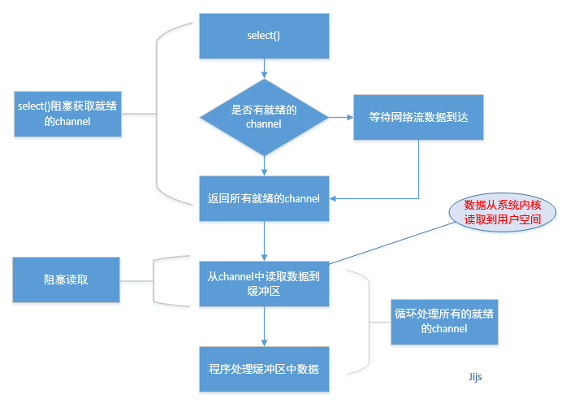

# 聊聊 Netty

> Vert.x 轻量 基于事件 异步 高性能

**It is comming soon !**
**TODO**

## Java 网络通信基础

### Echo 项目简介

### 网络通信工具类

### BIO 通讯/线程池优化/Echo 项目 BIO 实现

### NIO 通讯/阻塞与非阻塞模式/Buffer/Selector/Channel

### AIO 通讯/同步与异步/回调

## Netty 网络通信

### Echo 项目基础通讯实现

### 监听处理

### 粘包拆包

### 字符串类型数据传输

### 对象序列化/Java 序列化/Message Pack 序列化/Marshaling 序列化/Fast Json 序列化

## Netty 开发 HTTP

### Netty 实现基本的 HttpServer

### Netty 下实现 Cookie 与 Session

### Netty 实现 HttpClient

### Netty 实现 http 协议下图片传输

## Netty 实现原理浅析

> Netty 是一个提供 asynchronous event-driven （异步事件驱动）的网络应用框架，是一个用以快速开发高性能、可扩展协议的服务器和客户端。

Netty 是 JBoss 出品的高效的 Java NIO 开发框架。本文将主要分析 Netty 实现方面的东西，由于精力有限，本人并没有对其源码做了极细致的研 究。如果下面的内容有错误或不严谨的地方，也请指正和谅解。对于 Netty 使用者来说，Netty 提供了几个典型的 example，并有详尽的 API doc 和 guide doc，本文的一些内容及图示也来自于 Netty 的文档，特此致谢

### 总体架构

先放上一张漂亮的 Netty 总体结构图，下面的内容也主要围绕该图上的一些核心功能做分析，但对如 Container Integration 及 Security Support 等高级可选功能，本文不予分析。

### 网络模型

Netty 是典型的 Reactor 模型结构，关于 Reactor 的详尽阐释，可参考 POSA2,这里不做概念性的解释。而应用 Java NIO 构建 Reactor 模式，Doug Lea（就是那位让人无限景仰的大爷）在“Scalable IO in Java”中给了很好的阐述。这里截取其 PPT 中经典的图例说明 Reactor 模式的典型实现：

1、这是最简单的单 Reactor 单线程模型。Reactor 线程是个多面手，负责多路分离套接字，Accept 新连接，并分派请求到处理器链中。该模型 适用于处理器链中业务处理组件能快速完成的场景。不过，这种单线程模型不能充分利用多核资源，所以实际使用的不多。

2、相比上一种模型，该模型在处理器链部分采用了多线程（线程池），也是后端程序常用的模型。

3、 第三种模型比起第二种模型，是将 Reactor 分成两部分，mainReactor 负责监听 server socket，accept 新连接，并将建立的 socket 分派给 subReactor。subReactor 负责多路分离已连接的 socket，读写网 络数据，对业务处理功能，其扔给 worker 线程池完成。通常，subReactor 个数上可与 CPU 个数等同

说完 Reacotr 模型的三种形式，那么 Netty 是哪种呢？其实，我还有一种 Reactor 模型的变种没说，那就是去掉线程池的第三种形式的变种，这也 是 Netty NIO 的默认模式。在实现上，Netty 中的 Boss 类充当 mainReactor，NioWorker 类充当 subReactor（默认 NioWorker 的个数是 `Runtime.getRuntime().availableProcessors()`）。在处理新来的请求 时，NioWorker 读完已收到的数据到 ChannelBuffer 中，之后触发 `ChannelPipeline` 中的 ChannelHandler 流。

Netty 是事件驱动的，可以通过 ChannelHandler 链来控制执行流向。因为 ChannelHandler 链的执行过程是在 subReactor 中同步的，所以如果业务处理 handler 耗时长，将严重影响可支持的并发数。这种模型适合于像 Memcache 这样的应用场景，但 对需要操作数据库或者和其他模块阻塞交互的系统就不是很合适。Netty 的可扩展性非常好，而像 ChannelHandler 线程池化的需要，可以通过在 ChannelPipeline 中添加 Netty 内置的 ChannelHandler 实现类–ExecutionHandler 实现，对使用者来说只是 添加一行代码而已。对于 ExecutionHandler 需要的线程池模型，Netty 提供了两种可 选：1） `MemoryAwareThreadPoolExecutor` 可控制 Executor 中待处理任务的上限（超过上限时，后续进来的任务将被阻 塞），并可控制单个 Channel 待处理任务的上限；2）`OrderedMemoryAwareThreadPoolExecutor` 是 `MemoryAwareThreadPoolExecutor` 的子类，它还可以保证同一 Channel 中处理的事件流的顺序性，这主要是控制事件在异步处 理模式下可能出现的错误的事件顺序，但它并不保证同一 Channel 中的事件都在一个线程中执行（通常也没必要）。一般来 `说，OrderedMemoryAwareThreadPoolExecutor` 是个很不错的选择，当然，如果有需要，也可以 DIY 一个。

### BIO ， AIO ， NIO

BIO 阻塞 IO , 线程发起 IO 请求，不管内核是否准备好 IO 操作，从发起请求起，线程一直阻塞，直到操作完成。如下图

NIO (reactor 模型)：线程发起 IO 请求，立即返回；内核在做好 IO 操作的准备之后，通过调用注册的回调函数通知线程做 IO 操作，线程开始阻塞，直到操作完成。如下图

AIO 异步 IO ，(proactor 模型)：线程发起 IO 请求，立即返回；内存做好 IO 操作的准备之后，做 IO 操作，直到操作完成或者失败，通过调用注册的回调函数通知线程做 IO 操作完成或者失败。如下图

- BIO 是一个连接一个线程。 同步并阻塞
- NIO 是一个请求一个线程。 同步非阻塞
- AIO 是一个有效请求一个线程。 异步非阻塞

## 参考

- [Vext.x Docs](https://vertx.io/docs/)
- [netty 原理浅析](http://www.importnew.com/15656.html?utm_medium=referral)
