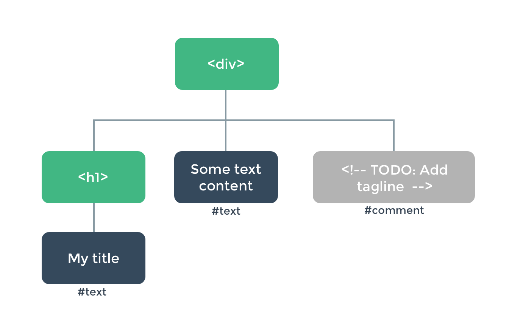

# Vue 基础知识入门

> Vue 一套构建用户界面的渐进式框架,只关注视图层， 采用自底向上增量开发的设计。Vue 的目标是通过尽可能简单的 API 实现响应的数据绑定和组合的视图组件。

### 建议花少量时间了解一下 ES6 的语法 看一点点 SASS

比如知道

- ES6 的箭头函数
- module export import
- class
- var 变为 let const
- 模板字符串 `hello ${name}`
- 键值一样的可以简化

  ```js
  return {
    name: name,
    age: age
  }

  return {
    name,
    age
  }
  ```

- 展开运算符 `[...array,a,b,c] or { ...object,name }`
- Promise `new Promise(function(resolve,reject){`
- Generators yield
- async await

```js
async function basicDemo() {
  let result = await Math.random()
  console.log(result)
}
```

## 组件 component

example

```vue
<script>
//import { authComputed } from '@state/helpers'

export default {
  components: {
    //
  },
  data() {
    return {
      count: 0
    }
  },
  computed: {
    //
  }
}
</script>

<template>
  <button v-on:click="count++">You clicked me {{ count }} times.</button>
</template>

<style lang="scss" module></style>
```

使用一个组件

```html
<div id="components-demo">
  <button-counter></button-counter>
</div>
```


- 组件是一个有名字的可以复用的 Vue 实例
- 组件一般包含三部分 template script style
- 组件可以接受一些选项来配置他
- 组件分为全局组件和局部的
- 组件通过属性向下传递数据给子组件，通过事件向上传递数据 DDAU
  - `<blog-post`
    `v-for="post in posts"`
    `v-bind:key="post.id"`
    `v-bind:title="post.title"`
    `></blog-post>`
  - `<button v-on:click="$emit('enlarge-text', 0.1)">`
    `Enlarge text`
    `</button>`
- 组件可以是
  - `String templates (e.g. template: '...')`
  - `Single-file (.vue) components`
  - `<script type="text/x-template">`
- 组件可以是动态，也可以是异步的
  - `<!-- Inactive components will be cached! -->`
    `<keep-alive>`
    `<component v-bind:is="currentTabComponent"></component>`
    `</keep-alive>`
  - Vue 2.3.0+ 支持
    ```js
    const AsyncComponent = () => ({
      // The component to load (should be a Promise)
      component: import('./MyComponent.vue'),
      // A component to use while the async component is loading
      loading: LoadingComponent,
      // A component to use if the load fails
      error: ErrorComponent,
      // Delay before showing the loading component. Default: 200ms.
      delay: 200,
      // The error component will be displayed if a timeout is
      // provided and exceeded. Default: Infinity.
      timeout: 3000
    })
    ```
  * Vue 组件有生命周期

## 组件的生命周期


- beforeCreate : 组件实例刚被创建，组件属性计算之前（data 等）
- created : 组件实例创建完成，属性已绑定，但 DOM 未生成，\$el 属性还不存在。
- beforeMount ： 模板编译/挂载之前
- mounted : 模板编译/挂载之后
- beforeUpdate : 组件更新之前
- updated : 组件更新之后
- > activated ： for keep-alive 组件被激活时调用
- > deactivated : for keep-alive 组件被移除时调用
- beforeDestroy ： 组件销毁之前
- destroyed : 组件销毁之后

- > errorCaptured : 当任何一个他的子组件的错误被捕获时调用 2.5.0+

## 模板指令

- `v-if`
- `v-for`
- `v-model`
- `v-html`
- `{ { msg } }`
- `{ { message.split('').reverse().join('') } }`

### 简写指令

- `<!-- full syntax -->` <br>
  `<a v-bind:href="url"> ... </a>` <br>
  `` <br>
  `<!-- shorthand -->` <br>
  `<a :href="url"> ... </a>`<br>
- `<!-- full syntax -->`<br>
  `<a v-on:click="doSomething"> ... </a>`<br>
  ``<br>
  `<!-- shorthand -->`<br>
  `<a @click="doSomething"> ... </a>`<br>

## 数据绑定

```html
<span>Multiline message is:</span>
<p style="white-space: pre-line;">{{ message }}</p>
<br />
<textarea v-model="message" placeholder="add multiple lines"></textarea>
```

默认的是同步的，也可以是 lazy 的修改其默认行为
`<!-- synced after "change" instead of "input" -->`
`<input v-model.lazy="msg" >`

- `.trim`
- `.lazy`
- `.number`
- `.sync`

> **Tips** 默认的 sync 修饰符，通过 input 事件修改 model 的值，使用了 lazy 修饰符的时候，input 事件过程不修改 model 的值，在失去焦点的时候触发 change 事件再修改 model 的值

### 关于 `v-model`

```html
<input v-model="searchText" />
```

其实他是下面的写法的语法糖

```html
<input
  v-bind:value="searchText"
  v-on:input="searchText = $event.target.value"
/>
```

同样的对于自定义组件也适用

```html
<custom-input
  v-bind:value="searchText"
  v-on:input="searchText = $event"
></custom-input>
```

## 虚拟 DOM

对于浏览器渲染一段 html 比如

```html
<div>
  <h1>My title</h1>
  Some text content
  <!-- TODO: Add tagline  -->
</div>
```

浏览器话先创建维护一个叫 DOM 的节点树

每个 html 元素对应一个 dom 节点
对于 Vue 会创建维护一个类似的叫 Virtual DOM 来追踪真实 DOM 的变动，实现 Vue 的指令，属性等特性

## Mixins 混入

mixin 是一中更灵活的复用功能组件的方式，一个 mizxin 对象可以包含任何组件的配置选项，使用他之后，所以的配置选项都会混合进当前组件选项

## 自定义指令

```js
// Register a global custom directive called `v-focus`
Vue.directive('focus', {
  // When the bound element is inserted into the DOM...
  inserted: function(el) {
    // Focus the element
    el.focus()
  }
})
```

- Vue 指令提供了一些 Hooks
  - bind
  - insert
  - update
  - componentUpdated
  - unbind
- [详见 Hook-Functions 文档](https://vuejs.org/v2/guide/custom-directive.html#Hook-Functions)

## 插件

通常用来给 Vue 添加全局性的功能，自定义标签指令等

```js
MyPlugin.install = function (Vue, options) {
  // 1. add global method or property
  Vue.myGlobalMethod = function () {
    // some logic ...
  }

  // 2. add a global asset
  Vue.directive('my-directive', {
    bind (el, binding, vnode, oldVnode) {
      // some logic ...
    }
    ...
  })

  // 3. inject some component options
  Vue.mixin({
    created: function () {
      // some logic ...
    }
    ...
  })

  // 4. add an instance method
  Vue.prototype.$myMethod = function (methodOptions) {
    // some logic ...
  }
}
```

[参考官方文档](https://vuejs.org/v2/guide/plugins.html#Writing-a-Plugin)

## 关于开发和构建生产包

- [ Vue-cli3 ](https://cli.vuejs.org/guide/prototyping.html)
  > vue serve 号称零配置
- Webpack

## 路由 Routing

```js
const NotFound = { template: '<p>Page not found</p>' }
const Home = { template: '<p>home page</p>' }
const About = { template: '<p>about page</p>' }

const routes = {
  '/': Home,
  '/about': About
}

new Vue({
  el: '#app',
  data: {
    currentRoute: window.location.pathname
  },
  computed: {
    ViewComponent() {
      return routes[this.currentRoute] || NotFound
    }
  },
  render(h) {
    return h(this.ViewComponent)
  }
})
```

## 状态管理 State Management

**Vuex**

```js
var store = {
  debug: true,
  state: {
    message: 'Hello!'
  },
  setMessageAction(newValue) {
    if (this.debug) console.log('setMessageAction triggered with', newValue)
    this.state.message = newValue
  },
  clearMessageAction() {
    if (this.debug) console.log('clearMessageAction triggered')
    this.state.message = ''
  }
}

var vmA = new Vue({
  data: {
    privateState: {},
    sharedState: store.state
  }
})

var vmB = new Vue({
  data: {
    privateState: {},
    sharedState: store.state
  }
})
```


## 服务端渲染 SSR - Server Side Rendering

**nuxt.js**
[SSR guide](https://ssr.vuejs.org/)
