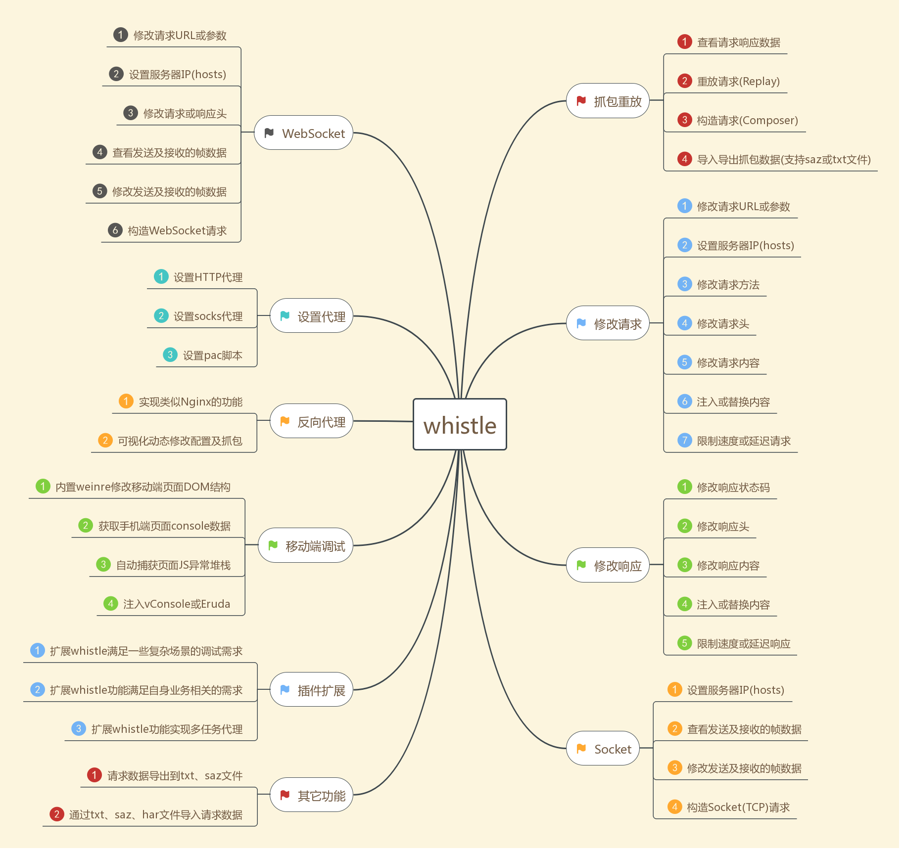

# common goods

## [weinre](https://people.apache.org/~pmuellr/weinre/docs/latest/Home.html)

Weinre 的本意是 Web Inspector Remote，它是一种远程调试工具。功能与 Firebug、Webkit inspector 类似，可以帮助我们即时更改页面元素、样式，调试 JS 等

## [nginxconfig](https://nginxconfig.io)

提供一个可视化的界面选中一些配置项，自动生成 nginx 配置网站

## lottie airbnb/lottie-web

Easily add high-quality animation to any native app.
http://airbnb.io/lottie/

Lottie is an iOS, Android, and React Native library that renders After Effects animations in real time, allowing apps to use animations as easily as they use static images.

[https://www.lottiefiles.com](https://www.lottiefiles.com) 这里是一个分享交流 lottiefiles 的网站
[预览 lottie 效果](https://www.lottiefiles.com/preview)

## jesseduffield/lazygit

A simple terminal UI for git commands, written in Go with the gocui library.

Are YOU tired of typing every git command directly into the terminal, but you're too stubborn to use Sourcetree because you'll never forgive Atlassian for making Jira? This is the app for you!

## a copy of my .npmrc config

```bash
registry=https://registry.npm.taobao.org/
sass_binary_site=https://npm.taobao.org/mirrors/node-sass/
phantomjs_cdnurl=https://npm.taobao.org/mirrors/phantomjs/
electron_mirror=https://npm.taobao.org/mirrors/electron/
disturl=https://npm.taobao.org/dist
NVM_NODEJS_ORG_MIRROR=http://npm.taobao.org/mirrors/node
NVM_IOJS_ORG_MIRROR=http://npm.taobao.org/mirrors/iojs
PHANTOMJS_CDNURL=https://npm.taobao.org/dist/phantomjs
ELECTRON_MIRROR=http://npm.taobao.org/mirrors/electron/
SASS_BINARY_SITE=http://npm.taobao.org/mirrors/node-sass
SQLITE3_BINARY_SITE=http://npm.taobao.org/mirrors/sqlite3
PYTHON_MIRROR=http://npm.taobao.org/mirrors/python

```

## How to Run Framer JS on Windows

Since releasing the Fluent Design Toolkit, there’s been a lot of interest in the Windows Framer Toolkit. Framer is a powerful tool that we use every day here at Microsoft, which may lead some to wonder How do you run Framer on Windows?

Framer Studio is only available for Mac. But since Framer’s code is open source, you can compile and run on Windows without much hassle (ok, a little bit). There are two options to do this. Option 1 is based on node.js, uses VS Code, and Gulp. We use this method a lot, especially since we create and use a lot of modules, and it offers full module support. Option 2 is easier, uses Atom, but has some limitations, especially with modules.

### **Option 1— Framer Boilerplate**

- Install node.js
- Install Git (if you haven’t already)
- Install Gulp — Open up Command Prompt and type npm install -g gulp-cli. Gulp enables compiling a Framer project and viewing it in any browser.
- Download Framer Boilerplate to a place that you’ll remember. You’ll be coming back to this for each Framer project you create. Framer Boilerplate is what does all the Framery magic.
- Copy the Framer Boilerplate files to your working directory. I put mine at C:\src\[project-name]
- If you are using any Modules, put them in the C:\src\[project-name]\app\modules\ directory. You’ll see we’ve already included some basic modules from the Windows Framer Toolkit.
- In Command Prompt, browse to your project cd \src\[project-name]and type npm install.
- Open up your project in VS Code. Because CoffeeScript files are whitespace dependent, it’s important to make sure your code editor has the correct whitespace and tab settings.
  - Tab space: 4
  - Tab type: hard
- In Command Prompt, run a gulp server by typing gulp from the root of your project.
- Browse to http://localhost:3000 and witness the magic!

## spring boot starter config

```java

@Configuration  //指定这个类是一个配置类
@ConditionalOnXXX  //在指定条件成立的情况下自动配置类生效
@AutoConfigureAfter  //指定自动配置类的顺序
@Bean  //给容器中添加组件
@ConfigurationPropertie结合相关xxxProperties类来绑定相关的配置
@EnableConfigurationProperties //让xxxProperties生效加入到容器中
自动配置类要能加载
将需要启动就加载的自动配置类，配置在META‐INF/spring.factories
org.springframework.boot.autoconfigure.EnableAutoConfiguration=\
org.springframework.boot.autoconfigure.admin.SpringApplicationAdminJmxAutoConfiguration,\

```

**spring boot @Conditional**

```java
@ConditionalOnBean：当SpringIoc容器内存在指定Bean的条件
@ConditionalOnClass：当SpringIoc容器内存在指定Class的条件
@ConditionalOnExpression：基于SpEL表达式作为判断条件
@ConditionalOnJava：基于JVM版本作为判断条件
@ConditionalOnJndi：在JNDI存在时查找指定的位置
@ConditionalOnMissingBean：当SpringIoc容器内不存在指定Bean的条件
@ConditionalOnMissingClass：当SpringIoc容器内不存在指定Class的条件
@ConditionalOnNotWebApplication：当前项目不是Web项目的条件
@ConditionalOnProperty：指定的属性是否有指定的值
@ConditionalOnResource：类路径是否有指定的值
@ConditionalOnSingleCandidate：当指定Bean在SpringIoc容器内只有一个，或者虽然有多个但是指定首选的Bean
@ConditionalOnWebApplication：当前项目是Web项目的条件
```

以上注解都是元注解 @Conditional 演变而来的，根据不用的条件对应创建以上的具体条件注解。

**在 Spring 中也有一种类似与 Java SPI 的加载机制。它在 META-INF/spring.factories 文件中配置接口的实现类名称，然后在程序中读取这些配置文件并实例化。这种自定义的 SPI 机制是 Spring Boot Starter 实现的基础。**

> spring-core 包里定义了 SpringFactoriesLoader 类，这个类实现了检索 META-INF/spring.factories 文件，并获取指定接口的配置的功能。在这个类中定义了两个对外的方法： `loadFactories -> loadFactoryNames -> loadSpringFactories`

- loadFactories。根据接口类获取其实现类的实例，这个方法返回的是对象列表。
- loadFactoryNames。根据接口获取其接口类的名称，这个方法返回的是类名的列表。
  > 上面的两个方法的关键都是从指定的 ClassLoader 中获取 spring.factories 文件，并解析得到类名列表， 加载 factories 文件 从代码中我们可以知道，在这个方法中会遍历整个 ClassLoader 中所有 jar 包下的 spring.factories 文件。也就是说我们可以在自己的 jar 中配置 spring.factories 文件，不会影响到其它地方的配置，也不会被别人的配置覆盖

## Ligature kudakurage Symbols

[Ligature kudakurage Symbols](http://kudakurage.com/ligature_symbols/) 一个 web font 库

## chrome plugins

- [CSS Peeper](#) Extract CSS and build beautiful styleguides.
- [WhatRuns](#) Discover what runs a website. Frameworks, Analytics Tools, Wordpress Plugins, Fonts - you name it.
- [Proxy SwitchyOmega](#) 轻松快捷地管理和切换多个代理设置
- [Vimium](#) The Hacker's Browser. Vimium provides keyboard shortcuts for navigation and control in the spirit of Vim.
- [StyleURL](#) StyleURL lets you export and share CSS tweaks instantly.
- [JSON-handle](#) It's a browser and editor for JSON document.You can get a beautiful view
- [Image Downloader](#) Browse and download images on a web page.
- [Ember Inspector](#) Tool for debugging Ember applications.
- [Vue.js devtools](#) Chrome and Firefox DevTools extension for debugging Vue.js applications.

## [trailofbits/algo](https://github.com/trailofbits/algo)

Algo VPN is a set of Ansible scripts that simplify the setup of a personal IPSEC VPN. It uses the most secure defaults available, works with common cloud providers, and does not require client software on most devices. See our release announcement for more information.

**Features**

- Supports only IKEv2 with strong crypto (AES-GCM, SHA2, and P-256) and WireGuard
- Generates Apple profiles to auto-configure iOS and macOS devices
- Includes a helper script to add and remove users
- Blocks ads with a local DNS resolver (optional)
- Sets up limited SSH users for tunneling traffic (optional)
- Based on current versions of Ubuntu and strongSwan
- Installs to DigitalOcean, Amazon Lightsail, Amazon EC2, Microsoft Azure, Google Compute Engine, Scaleway, OpenStack or your own Ubuntu 18.04 LTS server

## WireGuard

在 WireGuard 里，客户端和服务端基本是平等的，差别只是谁主动连接谁而已。双方都会监听一个 UDP 端口。双方都需要一对密钥。双方都需要把对方的公钥加进来。最后一步，谁主动连接，谁就是客户端

> Shadowsocks 是 Socks5 代理，WireGuard 和 GoVPN 是全局代理，走 UDP 协议，OpenVPN 支持 TCP/UDP 协议。UDP 协议很容易被宽带运营商 QoS 限速，在高峰期丢包严重，很影响速度，不过大多数翻墙软件在省际或国际出口都会收到 GFW 干扰

## tizonia

一个命令行音乐播放器，支持 Spotify, Google Play Music, YouTube 等服务

## [flex box defense](http://www.flexboxdefense.com/)

一个保卫 flex 盒子的小游戏，帮你熟悉 flex 布局的各种属性

## [CSS 网格布局学习指南](https://blog.jirengu.com/?p=990)

## [配色选择](https://colorhunt.co/popular)

## books

- Type Rules: The Designer's Guide to Professional Typography Fourth Edition
- About Face: The Essentials of Interaction Design Fourth Edition
- Understanding Color: An Introduction for Designers Fifth Edition

## yahoo/elide

Elide is a Java library that lets you stand up a GraphQL/JSON-API web service with minimal effort http://elide.io/
Elide 是一个互联网和移动端应用数据 API 搭建平台，只需要一个简单的 JPA 注释模型 就能帮您轻松搭建 GraphQL 和 JSON API web 服务的。

## enable Windows Subsystem Linux

```powershell
Enable-WindowsOptionalFeature -Online -FeatureName Microsoft-Windows-Subsystem-Linux
```

download the app dirtro

```powershell
Invoke-WebRequest -Uri https://aka.ms/wsl-ubuntu-1604 -OutFile Ubuntu.appx -UseBasicParsing
```

## WCPP

## [十倍效能提升——Web 基础研发体系的建立](https://www.cnblogs.com/sskyy/p/8613393.html)

## [avwo/whistle](https://github.com/avwo/whistle)

whistle(读音[ˈwɪsəl]，拼音[wēisǒu])基于 Node 实现的跨平台 web 调试代理工具，类似的工具有 Windows 平台上的 Fiddler，主要用于查看、修改 HTTP、HTTPS、Websocket 的请求、响应，也可以作为 HTTP 代理服务器使用，不同于 Fiddler 通过断点修改请求响应的方式，whistle 采用的是类似配置系统 hosts 的方式，一切操作都可以通过配置实现，支持域名、路径、正则表达式、通配符、通配路径等多种匹配方式，且可以通过 Node 模块扩展功能：


whistle 的所有操作都可以通过类似如下配置方式实现：

pattern operatorURI
其中：

- pattern 为匹配请求 url 的表达式，可以为：域名，路径，正则及通配符等等多种匹配方式：

```
  # 域名匹配
  www.example.com
  # 带端口的域名
  www.example.com:6666
  # 带协议的域名，支持：http、https、ws、wss、tunnel
  http://www.example.com

  # 路径匹配，同样支持带协议、端口
  www.example.com/test
  https:/www.exapmle.com/test
  https:/www.exapmle.com:6666/test

  # 正则匹配
  /^https?://www\.example\.com\/test/(.*)/ referer://http://www.test.com/$1

  # 通配符匹配
  ^www.example.com/test/*** referer://http://www.test.com/$1
```

- operatorURI 为对应的操作，由操作协议+操作值组成(operatorURI = opProtocol://opValue)：

```
opProtocol(操作协议)， 对应某类操作，如：
    # 设置请求服务器IP--host
    pattern host://opValue

    # 本地替换--file协议
    pattern file://opValue
opValue(操作值)， 对应具体操作的参数值，如：

    # 设置请求服务器IP--host协议
    pattern host://127.0.0.1:6666 # 或 pattern 127.0.0.1:6666

    # 本地替换--file协议
    pattern file:///User/test/dirOrFile # 或 pattern /User/test/dirOrFile
    pattern file://E:\test\dirOrFile # 或 pattern E:\test\dirOrFile
```

pattern 和 operatorURI 在多数情况下位置可以调换，且支持组合模式

## [各种折纸飞机](https://www.foldnfly.com/index.html)

## [ScriptOJ](http://scriptoj.mangojuice.top/)

ScriptOJ 是首个 Web 前端开发评测系统

从大量实战代码、面试题目中总结出精华题库和相应的测试

帮助你提升、锻炼 Web 开发技能，简单直接地获取第一手 Web 前端实战经验。

## [tailwind css](https://tailwindcss.com/)

一个值得去了解的工具型 CSS 框架，不提供基础的 UI 组件，但是提供很多 CSS 工具类
[使用 tailwind 实现的网站](https://builtwithtailwind.com/)

[A Hands-On Guide to Mobile-First Responsive Design](https://www.uxpin.com/studio/blog/a-hands-on-guide-to-mobile-first-design/)
以最小屏幕开始设计，再逐步到大的过程。这是实现响应式和自适应的一个相当不错的策略。

### The Mobile-First Design Process

- preset layout 选中一个 mobile 屏幕预设
- Content Inventory 列出内容清单
- Visual Hierarchy 对内容清单排序，确定内容的展示方式
- Design with the smallest breakpoints and then scale up 设计 mobile 的线框图，再扩展到到屏幕上去，直到屏幕的空白太多
- Enlarge touch targets 扩大触摸点 推荐 44px x 44px 为一个触摸点，给出连接足够的空白和大一点的按钮
- Don’t count on hovers 移动端还没有 hover 的手势控制实现
- Think "app" off-canvas navigation 交互同时不刷新页面
- Avoid large graphics 移动端大图片不适合
- Test it in a real device

## [crisp chat](https://crisp.chat/en/)

Give your customer experience a human touch
做客服集成的，一个不错的工具提供者，可以提供免费的 2 个坐席介入。

## LLVM (Low Level Virtual Machine)

LLVM（Low Level Virtual Machine）是一组库，包含了编译器的 building blocks。主要的模块包括：

- AST -> IR (Intermediate Representation 中间语言) generation
- IR 优化
- IR -> machine code generation

LLVM 的 IR 和 Java 的 byte code 很类似。IR 一种二进制语言，LLVM 把 IR 当作其内部模块的输入和输出 LLVM 也提供更高级的 code object（instruction object，function object），使得可以更方便的对 IR 进行编程。包括对函数进行 inline，移除指令，用常量替代一个计算，等等。Impala 用到了 LLVM 中的 IR 优化，以及 IR 生成机器码。

除了 LLVM，还有其他的生成代码的方式，但 LLVM 的效果更好

### 经典的编译流程

编译器通过词法分析 -> 语法分析 -> 语义分析 -> 中间代码优化 -> 目标代码生成，最终生成汇编指令，再由汇编语言根据不同的指令集生成对应的可执行程序

[ref The Architecture of Open Source Applications: LLVM ](http://www.aosabook.org/en/llvm.html)

## [FPGA 入门网站](https://www.fpga4fun.com)

FPGA 入门，感兴趣的可以去看看。
