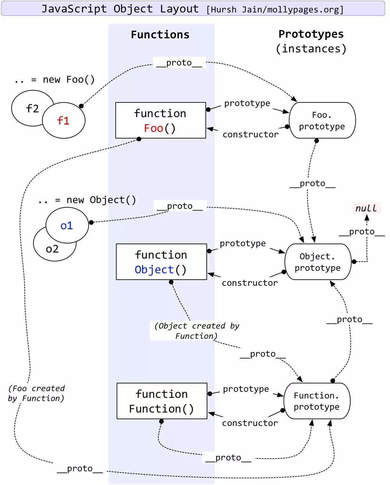

# 彻底理解 JavaScript 原型链

::: danger **proto**的默认指向
虽然 JavaScript 里一切皆对象，但为了理解原型链系统，我们需要将 JavaScript 的对象分为对象和函数两大类
:::

- 对象有**proto**属性，函数有 prototype 属性；
- 对象由函数生成;
- 生成对象时，对象的**proto**属性指向函数的 prototype 属性。

在没有手动修改**proto**属性的指向时，以上三条便是 JavaScript 默认原型链指向逻辑。

1. 一般情况

```js
创建空对象时，实际上我们是用Object函数来生成对象的：
>var o = {}
>o.__proto__ === Object.prototype
true

我们也可以显式的使用Object函数来创建对象：
>var o = Object()
o.__proto__ === Object.prototype
true

当我们使用函数来创建自定义的对象时，上面的规则同样适用：
>function MyObj(){}
>typeof MyObj
"function"
>var mo = new MyObj()
>mo.__proto__ === MyObj.prototype
true
```

2.  函数对象
    既然 JavaScript 里“一切皆对象”，那函数自然也是对象的一种。对于函数作为对象来说，上面的规则同样适用：

```js
函数对象都是由Function函数生成的：
>function fn(){}
>fn.__proto__ === Function.prototype
true

Function函数本身作为对象时，生成它的函数是他自身！
>Function.__proto__ === Function.prototype
true

Object函数既然是函数，那生成它的函数自然是Function函数咯：
>Object.__proto__ === Function.prototype
true
```

3. prototype 是谁？
   好了，现在我们知道，对象的**proto**属性是从生成它的函数的 prototype 那里得来的，那我们不禁要问，函数的 prototype 又是谁？

::: tip

```js
一般函数默认的prototype是系统自动生成的一个对象：
>function fn(){}
>typeof fn.prototype
"object"
>fn.prototype
{constructor: ƒ}
    constructor: ƒ fn()
    __proto__: Object

>fn.prototype.constructor === fn
true
>fn.prototype.__proto__ === Object.prototype
true
```

:::

我们从最一般的对象一直追溯到了 Object 函数和 Function 函数，并找在原型链的顶端发现了两个例外情况，也知道了这两个例外个规定是为了让**proto**构成的原型链存在一个唯一的终点。


