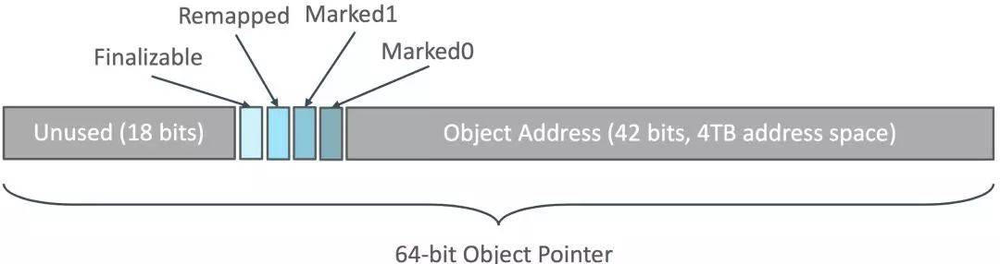
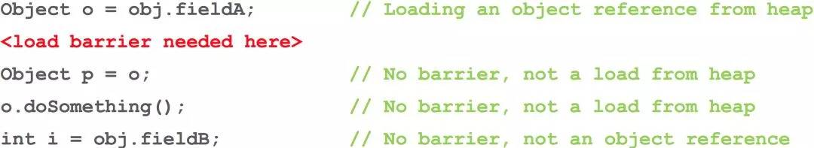

# ZGC 一些介绍

ZGC 在压缩堆内存的同时减少停顿时间，这里压缩堆内存是指移动存活的堆内存到一个连续区域，以减少堆上的内存碎片。减少停顿时间的方法：

- GC 使用多个线程来并行执行压缩。
- GC 压缩工作分割成多次停顿以实现增量压缩。
- 并发的执行压缩过程,压缩过程不停顿或者停顿很少的时间
- GO 的 GC 过程根本不压缩对内存就可以直接处理
- 你需要把一个对象复制到另一个地址上，同时其它线程可以读写旧的对象。
- 如果复制成功，可能还有很多堆上的对象指向旧对象的地址，这时候需要把他们跟新到新地址上。

### GC barries GC 屏障

GC 屏障是理解 ZGC 的如何实现并发压缩堆内的关键。有 GC 屏障的 GC，最 GC 读入一个堆上的引用对象的时候，他需要先做些额外处理。GC 屏障与 CPU 上的内存屏障不同。并发的压缩堆内存的 GC 都需要读屏障，基本的数据类型读写不需要读屏障。ZGC 额外保存了堆上的引用对象的元数据

```
 6                 4 4 4  4 4                                             0
 3                 7 6 5  2 1                                             0
+-------------------+-+----+-----------------------------------------------+
|00000000 00000000 0|0|1111|11 11111111 11111111 11111111 11111111 11111111|
+-------------------+-+----+-----------------------------------------------+
|                   | |    |
|                   | |    * 41-0 Object Offset (42-bits, 4TB address space)
|                   | |
|                   | * 45-42 Metadata Bits (4-bits)  0001 = Marked0
|                   |                                 0010 = Marked1
|                   |                                 0100 = Remapped
|                   |                                 1000 = Finalizable
|                   |
|                   * 46-46 Unused (1-bit, always zero)
|
* 63-47 Fixed (17-bits, always zero)
```

ZGC 并没有完全去掉 GC 的卡顿，但是 GC 停顿时间非常短，只有几毫秒。GC 的停顿时间只在开始标记,结束标记和开始重新分配开始时会发生短暂的停顿。ZGC 开始标记阶段，他会遍历所有的线程栈来标记应用的 root set(对象引用图的开始)。在 ZGC 结束标记阶段他会遍历所有的线程局部缓冲区标记并清空之。这个过程也分两段，开始.标结束记阶段.之后暂停一下，整个图包括子图遍历完成之后再继续.标结束记阶段.。开始再分配堆内存阶段与标记开始阶段类似会有短暂的暂停。

应用线程与 GC 线程并发执行互不影响。
比如开始的 Pause Mark Start 阶段，要做根集合（root set）扫描，包括全局变量啊、线程栈啊啥的里面的对象指针，但不包括 GC 堆里的对象指针，所以这个暂停就不会随着 GC 堆的大小而变化（不过会根据线程的多少啊、线程栈的大小之类的而变化.

### 并发执行的保证机制，就是 Colored Pointer 和 Load Barrier


Colored Pointer 从 64 位的指针中，借了几位出来表示 Finalizable、Remapped、Marked1、Marked0。 所以它不支持 32 位指针也不支持压缩指针， 且堆的上限是 4TB。

有 Load barrier 在，就会在不同阶段，根据指针颜色看看要不要做些特别的事情(Slow Path)。注意下图里只有第一种语句需要读屏障，后面三种都不需要，比如值是原始类型的时候。

### 像 G1 一样划分 Region，但更加灵活

ZGC 将堆划分为 Region 作为清理，移动，以及并行 GC 线程工作分配的单位。

不过 G1 一开始就把堆划分成固定大小的 Region，而 ZGC 可以有 2MB，32MB，N× 2MB 三种 Size Groups，动态地创建和销毁 Region，动态地决定 Region 的大小

256k 以下的对象分配在 Small Page， 4M 以下对象在 Medium Page，以上在 Large Page。

所以 ZGC 能更好的处理大对象的分配。

### 和 G1 一样会做 Compacting－压缩

CMS 是 Mark-Swap，标记过期对象后原地回收，这样就会造成内存碎片，越来越难以找到连续的空间，直到发生 Full GC 才进行压缩整理。

ZGC 是 Mark-Compact ，会将活着的对象都移动到另一个 Region，整个回收掉原来的 Region。

而 G1 是 incremental copying collector，一样会做压缩

1. Pause Mark Start －初始停顿标记
2. Concurrent Mark －并发标记
3. Relocate － 移动对象

> C4/ZGC 的 Quick Release 特性：活的对象都移走之后，这个 region 可以立即释放掉，并且用来当作下一个要扫描的 region 的 to region。所以理论上要收集整个堆，只需要有一个空 region 就 OK 了。

4. Remap － 修正指针

> 最后将指针都妥帖地更新指向新地址。这里 R 大还提到一个亮点： “上一个阶段的 Remap，和下一个阶段的 Mark 是混搭在一起完成的，这样非常高效，省却了重复遍历对象图的开销

### 没有 G1 占内存的 Remember Set，没有 Write Barrier 的开销

G1 保证“每次 GC 停顿时间不会过长”的方式，是“每次只清理一部分而不是全部的 Region”的增量式清理。

那独立清理某个 Region 时 , 就需要有 RememberSet 来记录 Region 之间的对象引用关系， 这样就能依赖它来辅助计算对象的存活性而不用扫描全堆， RS 通常占了整个 Heap 的 20%或更高。

这里还需要使用 Write Barrier(写屏障)技术，G1 在平时写引用时，GC 移动对象时，都要同步去更新 RememberSe，跟踪跨代跨 Region 间的引用，特别的重。而 CMS 里只有新老生代间的 CardTable，要轻很多。

ZGC 几乎没有停顿，所以划分 Region 并不是为了增量回收，每次都会对所有 Region 进行回收，所以也就不需要这个占内存的 RememberSet 了，又因为它暂时连分代都还没实现，所以完全没有 Write Barrier。

### 支持 Numa 架构

现在多 CPU 插槽的服务器都是 Numa 架构了，比如两颗 CPU 插槽(24 核)，64G 内存的服务器，那其中一颗 CPU 上的 12 个核，访问从属于它的 32G 本地内存，要比访问另外 32G 远端内存要快得多。

JDK 的 Parallel Scavenger 算法支持 Numa 架构，在 SPEC JBB 2005 基准测试里获得 40%的提升。

原理嘛，就是申请堆内存时，对每个 Numa Node 的内存都申请一些，当一条线程分配对象时，根据当前是哪个 CPU 在运行的，就在靠近这个 CPU 的内存中分配，这条线程继续往下走，通常会重新访问这个对象，而且如果线程还没被切换出去，就还是这位 CPU 同志在访问，所以就快了。

但可惜 CMS，G1 不支持 Numa，现在 ZGC 又重新做了简单支持

> G1 也打算支持了 Numa 了： http://openjdk.java.net/jeps/157

### ...

> 与标记对象的传统算法相比，ZGC 在指针上做标记，在访问指针时加入 Load Barrier（读屏障），比如当对象正被 GC 移动，指针上的颜色就会不对，这个屏障就会先把指针更新为有效地址再返回，也就是，永远只有单个对象读取时有概率被减速，而不存在为了保持应用与 GC 一致而粗暴整体的 Stop The World。

[听 R 大论 JDK11 的 ZGC](https://juejin.im/entry/5b86a276f265da435c4402d4)
[A FIRST LOOK INTO ZGC](https://dinfuehr.github.io/blog/a-first-look-into-zgc/)
[AZul 的《The Pauseless GC Algorithm》论文](https://www.usenix.org/legacy/events/vee05/full_papers/p46-click.pdf)
