# java 内存分配和 String 类型的深度解析

## 一、引题

在 java 语言的所有数据类型中，String 类型是比较特殊的一种类型，同时也是面试的时候经常被问到的一个知识点，本文结合 java 内存分配深度分析关于 String 的许多令人迷惑的问题。下面是本文将要涉及到的一些问题，如果读者对这些问题都了如指掌，则可忽略此文。

1. java 内存具体指哪块内存？这块内存区域为什么要进行划分？是如何划分的？划分之后每块区域的作用是什么？如何设置各个区域的大小？
2. String 类型在执行连接操作时，效率为什么会比 StringBuffer 或者 StringBuilder 低？StringBuffer 和 StringBuilder 有什么联系和区别？
3. java 中常量是指什么？`String s = "s" 和 String s = new String("s")` 有什么不一样？

[_转载_ 本文经多方资料的收集整理和归纳，最终撰写成文，如果有错误之处，请多多指教](https://my.oschina.net/xiaohui249/blog/170013)！

## 二、java 内存分配

1、JVM 简介
Java 虚拟机（Java Virtual Machine 简称 JVM）是运行所有 Java 程序的抽象计算机，是 Java 语言的运行环境，它是 Java 最具吸引力的特性之一。Java 虚拟机有自己完善的硬体架构，如处理器、堆栈、寄存器等，还具有相应的指令系统。JVM 屏蔽了与具体操作系统平台相关的信息，使得 Java 程序只需生成在 Java 虚拟机上运行的目标代码（字节码），就可以在多种平台上不加修改地运行。

一个运行时的 Java 虚拟机实例的天职是：负责运行一个 java 程序。当启动一个 Java 程序时，一个虚拟机实例也就诞生了。当该程序关闭退出，这个虚拟机实例也就随之消亡。如果同一台计算机上同时运行三个 Java 程序，将得到三个 Java 虚拟机实例。每个 Java 程序都运行于它自己的 Java 虚拟机实例中。
如下图所示，JVM 的体系结构包含几个主要的子系统和内存区：

1. 垃圾回收器（Garbage Collection）：负责回收堆内存（Heap）中没有被使用的对象，即这些对象已经没有被引用了。
2. 类装载子系统（Classloader Sub-System）：除了要定位和导入二进制 class 文件外，还必须负责验证被导入类的正确性，为类变量分配并初始化内存，以及帮助解析符号引用。
3. 执行引擎（Execution Engine）：负责执行那些包含在被装载类的方法中的指令。
4. 运行时数据区（Java Memory Allocation Area）：又叫虚拟机内存或者 Java 内存，虚拟机运行时需要从整个计算机内存划分一块内存区域存储许多东西。例如：字节码、从已装载的 class 文件中得到的其他信息、程序创建的对象、传递给方法的参数，返回值、局部变量等等。

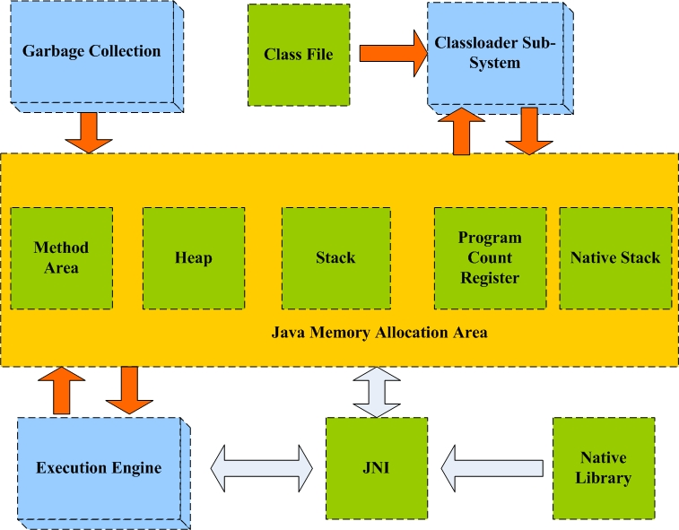

### 2、java 内存分区

从上节知道，运行时数据区即是 java 内存，而且数据区要存储的东西比较多，如果不对这块内存区域进行划分管理，会显得比较杂乱无章。程序喜欢有规律的东西，最讨厌杂乱无章的东西。 根据存储数据的不同，java 内存通常被划分为 5 个区域：程序计数器（Program Count Register）、本地方法栈（Native Stack）、方法区（Methon Area）、栈（Stack）、堆（Heap）。

程序计数器（Program Count Register）：又叫程序寄存器。JVM 支持多个线程同时运行，当每一个新线程被创建时，它都将得到它自己的 PC 寄存器（程序计数器）。如果线程正在执行的是一个 Java 方法（非 native），那么 PC 寄存器的值将总是指向下一条将被执行的指令，如果方法是 native 的，程序计数器寄存器的值不会被定义。 JVM 的程序计数器寄存器的宽度足够保证可以持有一个返回地址或者 native 的指针。

栈（Stack）：又叫堆栈。JVM 为每个新创建的线程都分配一个栈。也就是说,对于一个 Java 程序来说，它的运行就是通过对栈的操作来完成的。栈以帧为单位保存线程的状态。JVM 对栈只进行两种操作：以帧为单位的压栈和出栈操作。我们知道,某个线程正在执行的方法称为此线程的当前方法。我们可能不知道，当前方法使用的帧称为当前帧。当线程激活一个 Java 方法，JVM 就会在线程的 Java 堆栈里新压入一个帧，这个帧自然成为了当前帧。在此方法执行期间，这个帧将用来保存参数、局部变量、中间计算过程和其他数据。从 Java 的这种分配机制来看,堆栈又可以这样理解：栈(Stack)是操作系统在建立某个进程时或者线程(在支持多线程的操作系统中是线程)为这个线程建立的存储区域，该区域具有先进后出的特性。其相关设置参数：

`-Xss --设置方法栈的最大值`

本地方法栈（Native Stack）：存储本地方方法的调用状态。


**方法区（Method Area）：**当虚拟机装载一个 class 文件时，它会从这个 class 文件包含的二进制数据中解析类型信息，然后把这些类型信息（包括类信息、常量、静态变量等）放到方法区中，该内存区域被所有线程共享，如下图所示。本地方法区存在一块特殊的内存区域，叫常量池（Constant Pool），这块内存将与 String 类型的分析密切相关。


### 堆（Heap）

**Java 堆（Java Heap）** 是 Java 虚拟机所管理的内存中最大的一块。Java 堆是被所有线程共享的一块内存区域。在此区域的唯一目的就是存放对象实例，几乎所有的对象实例都是在这里分配内存，但是这个对象的引用却是在栈（Stack）中分配。因此，执行 String s = new String("s")时，需要从两个地方分配内存：在堆中为 String 对象分配内存，在栈中为引用（这个堆对象的内存地址，即指针）分配内存，如下图所示。


JAVA 虚拟机有一条在堆中分配新对象的指令，却没有释放内存的指令，正如你无法用 Java 代码区明确释放一个对象一样。虚拟机自己负责决定如何以及何时释放不再被运行的程序引用的对象所占据的内存，通常，虚拟机把这个任务交给垃圾收集器（Garbage Collection）。其相关设置参数：

- `-Xms -- 设置堆内存初始大小`
- `-Xmx -- 设置堆内存最大值`
- `-XX:MaxTenuringThreshold -- 设置对象在新生代中存活的次数`
- `-XX:PretenureSizeThreshold -- 设置超过指定大小的大对象直接分配在旧生代中`

Java 堆是垃圾收集器管理的主要区域，因此又称为“GC 堆”（Garbage Collectioned Heap）。现在的垃圾收集器基本都是采用的分代收集算法，所以 Java 堆还可以细分为：新生代（Young Generation）和老年代（Old Generation），如下图所示。分代收集算法的思想：第一种说法，用较高的频率对年轻的对象(young generation)进行扫描和回收，这种叫做 minor collection，而对老对象(old generation)的检查回收频率要低很多，称为 major collection。这样就不需要每次 GC 都将内存中所有对象都检查一遍，以便让出更多的系统资源供应用系统使用；另一种说法，在分配对象遇到内存不足时，先对新生代进行 GC（Young GC）；当新生代 GC 之后仍无法满足内存空间分配需求时， 才会对整个堆空间以及方法区进行 GC（Full GC）。

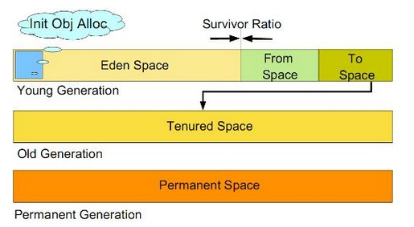

在这里可能会有读者表示疑问：记得还有一个什么**永久代（Permanent Generation）**的啊，难道它不属于 Java 堆？亲，你答对了！其实传说中的永久代就是上面所说的方法区，存放的都是 jvm 初始化时加载器加载的一些类型信息（包括类信息、常量、静态变量等），这些信息的生存周期比较长，GC 不会在主程序运行期对 PermGen Space 进行清理，所以如果你的应用中有很多 CLASS 的话,就很可能出现 PermGen Space 错误。其相关设置参数：

- -XX:PermSize --设置 Perm 区的初始大小

- -XX:MaxPermSize --设置 Perm 区的最大值

**新生代（Young Generation)**又分为：Eden 区和 Survivor 区，Survivor 区有分为 From Space 和 To Space。Eden 区是对象最初分配到的地方；默认情况下，From Space 和 To Space 的区域大小相等。JVM 进行 Minor GC 时，将 Eden 中还存活的对象拷贝到 Survivor 区中，还会将 Survivor 区中还存活的对象拷贝到 Tenured 区中。在这种 GC 模式下，JVM 为了提升 GC 效率， 将 Survivor 区分为 From Space 和 To Space，这样就可以将对象回收和对象晋升分离开来。新生代的大小设置有 2 个相关参数：

- -Xmn -- 设置新生代内存大小。

- -XX:SurvivorRatio -- 设置 Eden 与 Survivor 空间的大小比例

**老年代（Old Generation）**：  当  OLD  区空间不够时， JVM  会在  OLD  区进行  major collection ；完全垃圾收集后，若 Survivor 及 OLD 区仍然无法存放从 Eden 复制过来的部分对象，导致 JVM 无法在 Eden 区为新对象创建内存区域，则出现"Out of memory 错误"  。

## **三、String 类型的深度解析**

让我们从 Java 数据类型开始说起吧！Java 数据类型通常（分类方法多种多样）从整体上可以分为两大类：基础类型和引用类型，基础类型的变量持有原始值，引用类型的变量通常表示的是对实际对象的引用，其值通常为对象的内存地址。对于基础类型和引用类型的细分，直接上图吧，大家看了一目了然。当然，下图也仅仅只是其中的一种分类方式。

针对上面的图，有 3 点需要说明：

- char 类型可以单独出来形成一类，很多基本类型的分类为：数值类型、字符型（char）和 bool 型。

- returnAddress 类型是一个 Java 虚拟机在内部使用的类型，被用来实现 Java 程序中的 finally 语句。

- String 类型在上图的什么位置？yes，属于引用类型下面的类类型。下面开始对 String 类型的挖掘！

### **1\*\***、String 的本质\*\*

打开 String 的源码，类注释中有这么一段话“Strings are constant; their values cannot be changed after they are created. String buffers support mutable strings.Because String objects are immutable they can be shared.”。这句话总结归纳了 String 的一个最重要的特点：String 是值不可变(immutable)的常量，是线程安全的(can be shared)。
   接下来，String 类使用了 final 修饰符，表明了 String 类的第二个特点：String 类是不可继承的。
   下面是 String 类的成员变量定义，从类的实现上阐明了 String 值是不可变的(immutable)。
`private final char value[];`
`private final int count;`
   因此，我们看 String 类的 concat 方法。实现该方法第一步要做的肯定是扩大成员变量 value 的容量，扩容的方法重新定义一个大容量的字符数组 buf。第二步就是把原来 value 中的字符 copy 到 buf 中来，再把需要 concat 的字符串值也 copy 到 buf 中来，这样子，buf 中就包含了 concat 之后的字符串值。下面就是问题的关键了，如果 value 不是 final 的，直接让 value 指向 buf，然后返回 this，则大功告成，没有必要返回一个新的 String 对象。但是。。。可惜。。。由于 value 是 final 型的，所以无法指向新定义的大容量数组 buf，那怎么办呢？“return new String(0, count + otherLen, buf);”，这是 String 类 concat 实现方法的最后一条语句，重新 new 一个 String 对象返回。这下真相大白了吧！

**总结：\*\***String\***\*实质是字符数组，两个特点：\*\***1\***\*、该类不可被继承；\*\***2\***\*、不可变性\*\***(immutable)\***\*。**

### **2\*\***、String 的定义方法\*\*

在讨论 String 的定义方法之前，先了解一下常量池的概念，前面在介绍方法区的时候已经提到过了。下面稍微正式的给一个定义吧。
   常量池(constant pool)指的是在编译期被确定，并被保存在已编译的.class 文件中的一些数据。它包括了关于类、方法、接口等中的常量，也包括字符串常量。常量池还具备动态性，运行期间可以将新的常量放入池中，String 类的 intern()方法是这一特性的典型应用。不懂吗？后面会介绍 intern 方法的。虚拟机为每个被装载的类型维护一个常量池，池中为该类型所用常量的一个有序集合，包括直接常量(string、integer 和 float 常量)和对其他类型、字段和方法的符号引用（与对象引用的区别？读者可以自己去了解）。

String 的定义方法归纳起来总共为三种方式：

- 使用关键字 new，如：String s1 = new String("myString");

- 直接定义，如：String s1 = "myString";

- 串联生成，如：String s1 = "my" + "String";这种方式比较复杂，这里就不赘述了，请参见[java--String 常量池问题的几个例子](http://blog.csdn.net/gaopeng0071/article/details/11741027)。

第一种方式通过关键字 new 定义过程：在程序编译期，编译程序先去字符串常量池检查，是否存在“myString”,如果不存在，则在常量池中开辟一个内存空间存放“myString”；如果存在的话，则不用重新开辟空间，保证常量池中只有一个“myString”常量，节省内存空间。然后在内存堆中开辟一块空间存放 new 出来的 String 实例，在栈中开辟一块空间，命名为“s1”，存放的值为堆中 String 实例的内存地址，这个过程就是将引用 s1 指向 new 出来的 String 实例。**各位，最模糊的地方到了！堆中 new 出来的实例和常量池中的“myString”是什么关系呢？等我们分析完了第二种定义方式之后再回头分析这个问题。**

第二种方式直接定义过程：在程序编译期，编译程序先去字符串常量池检查，是否存在“myString”，如果不存在，则在常量池中开辟一个内存空间存放“myString”；如果存在的话，则不用重新开辟空间。然后在栈中开辟一块空间，命名为“s1”，存放的值为常量池中“myString”的内存地址。**常量池中的字符串常量与堆中的 String 对象有什么区别呢？为什么直接定义的字符串同样可以调用 String 对象的各种方法呢？**

带着诸多疑问，我和大家一起探讨一下堆中 String 对象和常量池中 String 常量的关系，请大家记住，仅仅是探讨，因为本人对这块也比较模糊。
**第一种猜想：**因为直接定义的字符串也可以调用 String 对象的各种方法，那么可以**认为其实在常量池中创建的也是一个\*\***String\***\*实例（对象）**。String s1 = new String("myString");先在编译期的时候在常量池创建了一个 String 实例，然后 clone 了一个 String 实例存储在堆中，引用 s1 指向堆中的这个实例。此时，池中的实例没有被引用。当接着执行 String s1 = "myString";时，因为池中已经存在“myString”的实例对象，则 s1 直接指向池中的实例对象；否则，在池中先创建一个实例对象，s1 再指向它。如下图所示：
[图片上传失败...(image-32f583-1534235377538)]

**这种猜想认为：常量池中的字符串常量实质上是一个 String 实例，与堆中的 String 实例是克隆关系。**

**第二种猜想**也是目前网上阐述的最多的，但是思路都不清晰，有些问题解释不通。下面引用[《JAVA String 对象和字符串常量的关系解析》](http://blog.csdn.net/sureyonder/article/details/5569366)一段内容。
       *在解析阶段，虚拟机发现字符串常量"myString"，它会在一个内部字符串常量列表中查找，如果没有找到，那么会在堆里面创建一个包含字符序列[myString]的 String 对象 s1，然后把这个字符序列和对应的 String 对象作为名值对( [myString], s1 )保存到内部字符串常量列表中。如下图所示：*

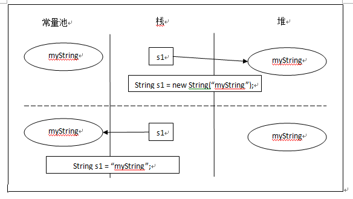

_如果虚拟机后面又发现了一个相同的字符串常量 myString，它会在这个内部字符串常量列表内找到相同的字符序列，然后返回对应的 String 对象的引用。维护这个内部列表的关键是任何特定的字符序列在这个列表上只出现一次。_ *例如，String s2 = "myString"，运行时 s2 会从内部字符串常量列表内得到 s1 的返回值，所以 s2 和 s1 都指向同一个 String 对象。*这个猜想有一个比较明显的问题，红色字体标示的地方就是问题的所在。证明方式很简单，下面这段代码的执行结果，javaer 都应该知道。
`String s1 = new String("myString");`
`String s2 = "myString";`
`System.out.println(s1 == s2); //按照上面的推测逻辑，那么打印的结果为true；而实际上真实的结果是false，因为s1指向的是堆中String对象，而s2指向的是常量池中的String常量。`
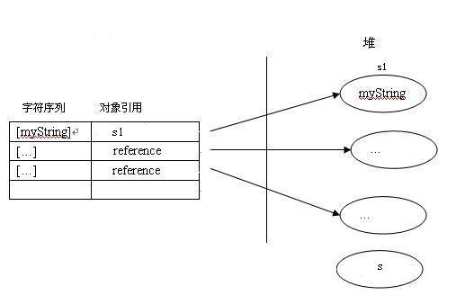

虽然这段内容不那么有说服力，但是文章提到了一个东西——字符串常量列表，它可能是解释这个问题的关键。

文中提到的三个问题，本文仅仅给出了猜想，请知道真正内幕的高手帮忙分析分析，谢谢！

- **堆中 new 出来的实例和常量池中的“myString”是什么关系呢？**

- **常量池中的字符串常量与堆中的 String 对象有什么区别呢？**

- **为什么直接定义的字符串同样可以调用 String 对象的各种方法呢？**

### **3\*\***、String、StringBuffer、StringBuilder 的联系与区别\*\* 

上面已经分析了 String 的本质了，下面简单说说 StringBuffer 和 StringBuilder。

StringBuffer 和 StringBuilder 都继承了抽象类 AbstractStringBuilder，这个抽象类和 String 一样也定义了 char[] value 和 int count，但是与 String 类不同的是，它们没有 final 修饰符。因此得出结论：**String、StringBuffer 和 StringBuilder 在本质上都是字符数组，不同的是，在进行连接操作时，String 每次返回一个新的 String 实例，而 StringBuffer 和 StringBuilder 的 append 方法直接返回 this，所以这就是为什么在进行大量字符串连接运算时，不推荐使用 String，而推荐 StringBuffer 和 StringBuilder。**那么，哪种情况使用 StringBuffe？哪种情况使用 StringBuilder 呢？

关于 StringBuffer 和 StringBuilder 的区别，翻开它们的源码，下面贴出 append()方法的实现。

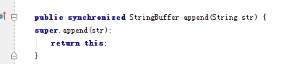

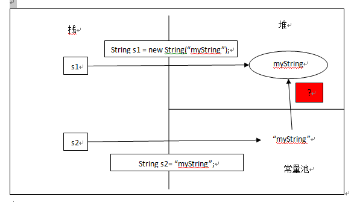

上面第一张图是 StringBuffer 中 append()方法的实现，第二张图为 StringBuilder 对 append()的实现。区别应该一目了然，StringBuffer 在方法前加了一个 synchronized 修饰，起到同步的作用，可以在多线程环境使用。为此付出的代价就是降低了执行效率。**因此，如果在多线程环境可以使用 StringBuffer 进行字符串连接操作，单线程环境使用 StringBuilder，它的效率更高。**

- 栈中用来存放一些原始数据类型的局部变量数据和对象的引用(String,数组.对象等等)但不存放对象内容
- 堆中存放使用 new 关键字创建的对象.
- 字符串是一个特殊包装类,其引用是存放在栈里的,而对象内容必须根据创建方式不同定(常量池和堆).有的是编译期就已经创建好，存放在字符串常 量池中，而有的是运行时才被创建.使用 new 关键字，存放在堆中

## **四、参考文献**

[Java 虚拟机体系结构](http://www.cnblogs.com/java-my-life/archive/2012/08/01/2615221.html) 
[Java 内存管理基础篇-Java 内存分配](http://hllvm.group.iteye.com/group/wiki/3053-JVM) 
[Java 堆内存设置优化](http://my.oschina.net/beiyou/blog/122394) 
[Java 内存管理和垃圾回收](http://hi.baidu.com/leonchunlai/item/cdbed2ff78d3d7c342c36a36) 
[Java 堆内存的转换和回收](http://www.51testing.com/html/16/310316-237256.html) 
[Java 虚拟机的 JVM 垃圾回收机制](http://www.im47.cn/post/2012/10/2012-10-24-jvm)

[浅谈设置 JVM 内存分配的几个妙招](http://developer.51cto.com/art/200907/135038.htm)
[深入 Java 字符串](http://lavasoft.blog.51cto.com/62575/80034/)
[Java 性能优化之 String 篇](http:///cn/java/j-lo-optmizestring/)
[java 字符串常量池知识](http://blog.sina.com.cn/s/blog_791db047010177w0.html)
[Java 内存分配及 String 类型详解](http://fanyo.iteye.com/blog/427097)
[Java String 的内存机制](http://www.oseye.net/user/kevin/blog/151)
[Java 之内存分析和 String 对象](http://www.cnblogs.com/devinzhang/archive/2012/01/25/2329463.html)

[String 类学习总结](http://www.cnblogs.com/gw811/archive/2012/09/10/2677770.html)

# jvm memory

## JVM Architecture, Memory Areas

### Thread States and Memory Areas:

A thread can be in only one state at a given point in time. These states are virtual machine states which do not reflect any operating system thread states [NEW, RUNNABLE, BLOCKED, WAITING, TIMED_WAITING, TERMINATED].

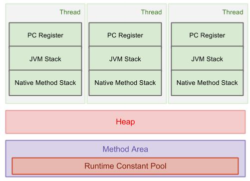

Java8 Update: PermGen is replaced with Metaspace which is very similar. Main difference is that Metaspace re-sizes dynamically i.e., It can expand at runtime. Java Metaspace space: unbounded (default)

The Heap is divided into young and old generations as follows :
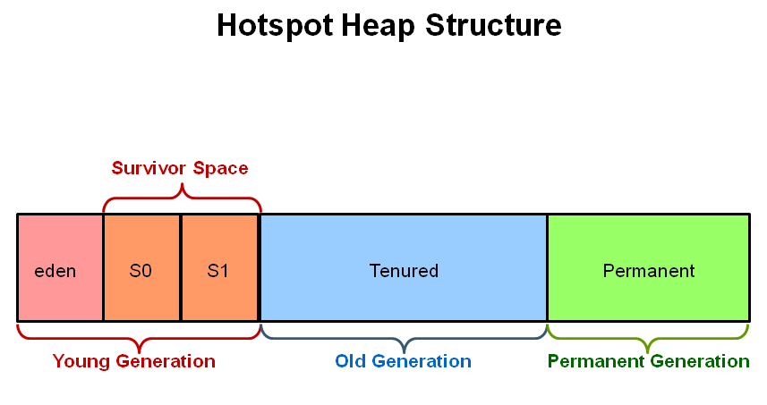

## Memory Areas

Java Heap Memory is part of memory allocated to JVM by Operating System. Whenever we create objects they are created inside [heap in java][http://www.oracle.com/webfolder/technetwork/tutorials/obe/java/gc01/index.html].

Java Heap space is divided into three regions or generation for sake of garbage collection called Young Generation, Old or tenured Generation and Permanent Generation. Permanent generation is garbage collected during full gc in hotspot JVM

The Young Generation is where all new objects are allocated and aged. When the young generation fills up, this causes a minor garbage collection. A young generation full of dead objects is collected very quickly. Some surviving objects are aged and eventually move to the old generation.

The Old Generation is used to store long surviving objects. Typically, a threshold is set for young generation object and when that age is met, the object gets moved to the old generation. Eventually the old generation needs to be collected. This event is called a major garbage collection.

The Permanent generation contains metadata required by the JVM to describe the classes and methods used in the application. The permanent generation is populated by the JVM at runtime based on classes in use by the application.

PermGen has been replaced with Metaspace since Java 8 release. PermSize & MaxPermSize parameters will be ignored now. Have a look this [dzone article][https://dzone.com/articles/java-8-permgen-metaspace] by Pierre - Hugues Charbonneau to understand about Metaspace.

enter image description here

Image source:http://www.oracle.com/webfolder/technetwork/tutorials/obe/java/gc01/index.html

Refer to same article for more details.

https://docs.oracle.com/javase/6/docs/technotes/guides/management/jconsole.html
As of Java 8, the PermGen space has been replaced with Metaspace.

http://stackoverflow.com/a/3849819/5081877

## 1. 什么是 JVM?

JVM 就是所谓的 Java 虚拟机，

## 2. JVM 内存划分

我们在编写程序时，经常会遇到 OOM（out of Memory）以及内存泄漏等问题。为了避免出现这些问题，我们首先必须对 JVM 的内存划分有个具体的认识。JVM 将内存主要划分为：方法区、虚拟机栈、本地方法栈、堆、程序计数器。JVM 运行时数据区如下：

### 程序计数器：

【我的理解】很好理解嘛。每一个线程都需要一个计数器记录它当前执行的字节，而程序计数器就是线程当前正在运行的字节码的行号指示器。

程序计数器是线程私有的区域，很好理解嘛~，每个线程当然得有个计数器记录当前执行到那个指令。占用的内存空间小，可以把它看成是当前线程所执行的字节码的行号指示器。如果线程在执行 Java 方法，这个计数器记录的是正在执行的虚拟机字节码指令地址；如果执行的是 Native 方法，这个计数器的值为空（Undefined）【不理解！！！why】。此内存区域是唯一一个在 Java 虚拟机规范中没有规定任何 OutOfMemoryError 情况的区域。

### 虚拟机栈

【我的理解】：Java 虚拟机栈就是专为 Java 程序中的方法服务的，属于线程私有。每调用一次方法，就想到于创建了一个栈帧，这个栈帧中存放着方法的局部变量等一些信息，调用方法就是栈帧的入栈和出栈。入栈为调用函数，出栈（删除栈顶）为函数调用结束。

注意这个区域可能出现的两种异常：一种是 StackOverflowError，当前线程请求的栈深度大于虚拟机所允许的深度时，会抛出这个异常。制造这种异常很简单：将一个函数反复递归自己，最终会出现栈溢出错误（StackOverflowError）。另一种异常是 OutOfMemoryError 异常，当虚拟机栈可以动态扩展时（当前大部分虚拟机都可以），如果无法申请足够多的内存就会抛出 OutOfMemoryError，如何制作虚拟机栈 OOM 呢，参考一下代码：

```java

public void stackLeakByThread(){
    while(true){
        new Thread(){
            public void run(){
                while(true){
                }
            }
        }.start()
    }
}
```

这段代码有风险，可能会导致操作系统假死，请谨慎使用~~~

### 本地方法栈（Native method）

【我的理解】本地方法栈专为非 Java 语言编写的程序服务，比如 C++,C 语言的程序接口。

### Java 堆

【我的理解】Java 堆可以说是虚拟机中最大一块内存了。它是所有线程所共享的内存区域，几乎所有的实例对象都是在这块区域中存放。当然，睡着 JIT 编译器的发展，所有对象在堆上分配渐渐变得不那么“绝对”了。

Java 堆是垃圾收集器管理的主要区域。由于现在的收集器基本上采用的都是分代收集算法，所有 Java 堆可以细分为：新生代和老年代。在细致分就是把新生代分为：Eden 空间、From Survivor 空间、To Survivor 空间。当堆无法再扩展时，会抛出 OutOfMemoryError 异常。

关键词：实例对象，垃圾处理，线程共享

### 方法区

方法区存放的是类信息、常量、静态变量等。方法区是各个线程共享区域，很容易理解，我们在写 Java 代码时，每个线程度可以访问同一个类的静态变量对象。由于使用反射机制的原因，虚拟机很难推测那个类信息不再使用，因此这块区域的回收很难。另外，对这块区域主要是针对常量池回收，值得注意的是 JDK1.7 已经把常量池转移到堆里面了。同样，当方法区无法满足内存分配需求时，会抛出 OutOfMemoryError。 制造方法区内存溢出，注意，必须在 JDK1.6 及之前版本才会导致方法区溢出，原因后面解释,执行之前，可以把虚拟机的参数-XXpermSize 和-XX：MaxPermSize 限制方法区大小。

## Java 内存效率

[这篇文章](http://www.ibm.com/developerworks/java/library/j-codetoheap/index.html)里详细的介绍了 JVM 中各种数据类型/集合对内存的使用情况。

**总的来说:**

1. JVM 是非常浪费内存的；

1. 并且和 CPU 资源不同，这种浪费，并不能通过 JVM 自动优化（CPU 优化有 JIT，内联等技术）

1. 只能通过小心的使用以及切换到高内存效率的库来实现。

### JVM 内存浪费在哪里

下图是 32 位机器中 JVM 进程的内存地址分布(4G)

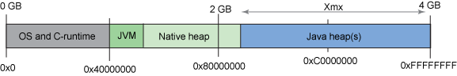

#### 1. Object

没错，Object 是 JVM 中一切内存浪费的根源

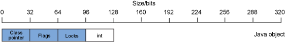

上图是 32 位 JVM 中一个 Integer 对象的内存占用情况，这个对象共占用 128bit 内存，其中只有 32bit 是真正的 int 数据. 其他的部分：

1. Class pointer: 指向对象对应的类信息(Class Info)的指针，也就是我们平时用的 obj.getClass()
1. Flags: 各种标志位，包括对象的 hashcode，对象是否为数组等信息
1. Lock: 对象对应的锁，用于 synchronized

这三类信息是**每一个**对象都要存储的，但却不都是真正有用的数据。

结论：Integer 对象，内存的使用效率是 1/4

#### 2. 数组

数组比普通的对象多一个 size 字段，如图：

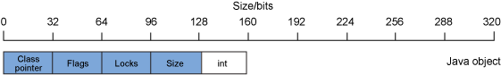

`int[]` 数组的存储使用率是 1/5，注意这是 size==1 的情况。如果有更多的数据，`int[]` 数组的内存使用率会提高。

但是 `Integer[]` 数组不会

#### 3. String

String 的存储大致如下：

```java
class String {
    int count;
    int offset;
    char[] value;
}
```

内存分布如下图：

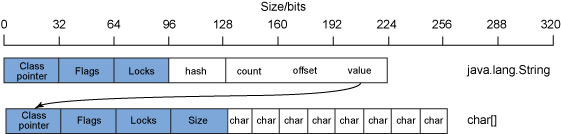

#### 4. 集合

#### 5. 集合的空余空间

#### 6. 自动可变长

## 解决方案：

### 优化小集合

1. 初始化时指定合理的 size
1. 减少对象的层次

### 使用高性能的集合/库

##### 1. `int[]` < `Integer[]` < `ArrayList<Integer>` < `Set<Integer>` < `Map<Integer, Integer>`

##### 2. [Trove](http://trove.starlight-systems.com/)

各种原始类型数据的集合：TIntList, TIntIntMap 等，接口和 java.util 里的集合差不多，但是更高效，并且节省大量内存

##### 3. [Javolution](http://javolution.org/)

> Javolution real-time goals are simple: To make your application faster and more time predictable!

一个高性能的实时计算库，实时版的 util / lang / text / io / xml

##### 4. Guava

### 减少抽象的层次

### 注意不必要的浪费

1. ConcurrentCollection
