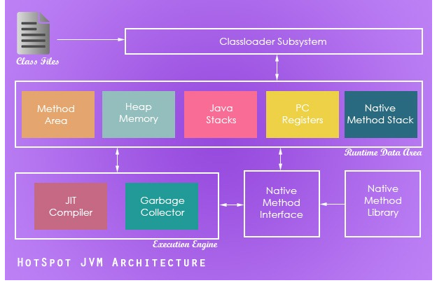
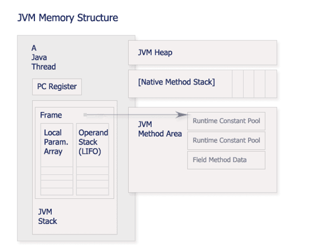
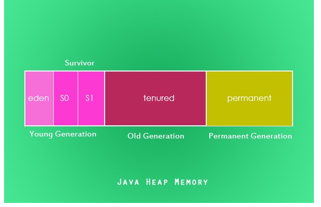

# JVM 的 工作原理，层次结构 以及 GC 工作原理

[转载读书笔记 ](https://segmentfault.com/a/1190000002579346)

---

Java 虚拟机（Java virtual machine，JVM）是运行 Java 程序必不可少的机制。

JVM 实现了 Java 语言最重要的特征：即平台无关性。这是因为：编译后的 Java 程序指令并不直接在硬件系统的 CPU 上执行，而是由 JVM 执行。JVM 屏蔽了与具体平台相关的信息，使 Java 语言编译程序只需要生成在 JVM 上运行的目标字节码（.class）,就可以在多种平台上不加修改地运行。Java 虚拟机在执行字节码时，把字节码解释成具体平台上的机器指令执行。因此实现 java 平台无关性。它是 Java 程序能在多平台间进行无缝移植的可靠保证，同时也是 Java 程序的安全检验引擎（还进行安全检查）。

JVM 是编译后的 Java 程序（.class 文件）和硬件系统之间的接口 （ 编译后：javac 是收录于 JDK 中的 Java 语言编译器。该工具可以将后缀名为. java 的源文件编译为后缀名为. class 的可以运行于 Java 虚拟机的字节码。）

---

## JVM architecture



图片摘自 httpjavapapers.comjavajava-garbage-collection-introduction

JVM = 类加载器 classloader + 执行引擎 execution engine + 运行时数据区域 runtime data area
classloader 把硬盘上的 class 文件加载到 JVM 中的运行时数据区域, 但是它不负责这个类文件能否执行，而这个是 执行引擎 负责的。

---

### classloader

作用：装载.class 文件

classloader 有两种装载 class 的方式 （时机）：

1. 隐式：运行过程中，碰到 new 方式生成对象时，隐式调用 classLoader 到 JVM

2. 显式：通过 class.forname()动态加载

**双亲委派模型（Parent Delegation Model）**：

类的加载过程采用双亲委托机制，这种机制能更好的保证 Java 平台的安全。
该模型要求除了顶层的 Bootstrap class loader 启动类加载器外，其余的类加载器都应当有自己的`父类加载器`。子类加载器和父类加载器`不是以继承（Inheritance）的关系`来实现，而是通过`组合（Composition）关系`来复用父加载器的代码。每个类加载器都有自己的命名空间（由该加载器及所有父类加载器所加载的类组成，在同一个命名空间中，不会出现类的完整名字（包括类的包名）相同的两个类；在不同的命名空间中，有可能会出现类的完整名字（包括类的包名）相同的两个类）。

双亲委派模型的工作过程为：

1.当前 ClassLoader 首先从自己已经加载的类中查询是否此类已经加载，如果已经加载则直接返回原来已经加载的类。

> 每个类加载器都有自己的加载缓存，当一个类被加载了以后就会放入缓存，
> 等下次加载的时候就可以直接返回了。

2.当前 classLoader 的缓存中没有找到被加载的类的时候，委托父类加载器去加载，父类加载器采用同样的策略，首先查看自己的缓存，然后委托父类的父类去加载，一直到 bootstrap ClassLoader.

3.当所有的父类加载器都没有加载的时候，再由当前的类加载器加载，并将其放入它自己的缓存中，以便下次有加载请求的时候直接返回。

使用这种模型来组织类加载器之间的关系的好处
主要是为了`安全性`，避免用户自己编写的类动态替换 Java 的一些核心类，比如 String，同时也避免了`重复加载`，因为 JVM 中区分不同类，不仅仅是根据类名，相同的 class 文件被不同的 ClassLoader 加载就是不同的两个类，如果相互转型的话会抛 java.lang.ClassCaseException.

类加载器 classloader 是具有层次结构的，也就是父子关系。其中，Bootstrap 是所有类加载器的父亲。如下图所示：


Bootstrap class loader： 父类
当运行 java 虚拟机时，这个类加载器被创建，它负责加载虚拟机的核心类库，如 java.lang. 等。例如 java.lang.Object 就是由根类加载器加载的。需要注意的是，这个类加载器不是用 java 语言写的，而是用 CC++ 写的。

Extension class loader
这个加载器加载出了基本 API 之外的一些拓展类。

AppClass Loader
加载应用程序和程序员自定义的类。

除了以上虚拟机自带的加载器以外，用户还可以定制自己的类加载器（User-defined Class Loader）。Java 提供了抽象类 java.lang.ClassLoader，所有用户自定义的类加载器应该继承 ClassLoader 类。

这是 JVM 分工自治生态系统的一个很好的体现。

引用：http://www.importnew.com6581.html

---

### 执行引擎

作用： 执行字节码，或者执行本地方法

### 运行时数据

JVM 运行时数据区 (JVM Runtime Area) 其实就是指 JVM 在运行期间，其对 JVM 内存空间的划分和分配。JVM 在运行时将数据划分为了 6 个区域来存储。

程序员写的所有程序都被加载到`运行时数据区域`中，不同类别存放在 heap, java stack, native method stack, PC register, method area.

下面对各个部分的功能和存储的内容进行描述：



1、PC 程序计数器：一块较小的内存空间，可以看做是当前`线程`所执行的字节码的行号指示器, NAMELY 存储每个线程下一步将执行的 JVM 指令，如该方法为 native 的，则 PC 寄存器中不存储任何信息。Java 的多线程机制离不开程序计数器，每个线程都有一个自己的 PC，以便完成不同线程上下文环境的切换。

2、java 虚拟机栈：与 PC 一样，java 虚拟机栈也是线程私有的。每一个 JVM 线程都有自己的 java 虚拟机栈，这个栈与线程同时创建，它的生命周期与线程相同。虚拟机栈描述的是`Java 方法执行的内存模型`：每个方法被执行的时候都会同时创建一个`栈帧（Stack Frame）`用于存储局部变量表、操作数栈、动态链接、方法出口等信息。`每一个方法被调用直至执行完成的过程就对应着一个栈帧在虚拟机栈中从入栈到出栈的过程`。

3、本地方法栈：与虚拟机栈的作用相似，虚拟机栈为虚拟机执行执行 java 方法服务，而本地方法栈则为虚拟机使用到的本地方法服务。

4、Java 堆：被所有线程共享的一块存储区域，在虚拟机启动时创建，它是 JVM 用来存储对象实例以及数组值的区域，可以认为 Java 中所有通过 new 创建的对象的内存都在此分配。

Java 堆在 JVM 启动的时候就被创建，堆中储存了各种对象，这些对象被自动管理内存系统（Automatic Storage Management System，也即是常说的 “Garbage Collector（垃圾回收器）”）所管理。这些对象无需、也无法显示地被销毁。

JVM 将 Heap 分为两块：新生代 New Generation 和旧生代 Old Generation

Note:

- 堆在 JVM 是所有线程共享的，因此在其上进行对象内存的分配均需要进行加锁，这也是 new 开销比较大的原因。
- 鉴于上面的原因，Sun Hotspot JVM 为了提升对象内存分配的效率，对于所创建的线程都会分配一块独立的空间，这块空间又称为 TLAB
- TLAB 仅作用于新生代的 Eden Space，因此在编写 Java 程序时，通常多个小的对象比大的对象分配起来更加高效

5、方法区

方法区和堆区域一样，是各个线程共享的内存区域，它用于存储每一个`类的结构信息`，例如运行时常量池，成员变量和方法数据，构造函数和普通函数的字节码内容，还包括一些在类、实例、接口初始化时用到的特殊方法。当开发人员在程序中通过 Class 对象中的 getName、isInstance 等方法获取信息时，这些数据都来自方法区。

方法区也是全局共享的，在虚拟机启动时候创建。在一定条件下它也会被 GC。这块区域对应 Permanent Generation 持久代。 XX：PermSize 指定大小。

6、运行时常量池
其空间从方法区中分配，存放的为类中固定的常量信息、方法和域的引用信息。

---

## GC

[javapapers](http://javapapers.com/java/how-java-garbage-collection-works/)

> Java garbage collection is an automatic process to manage the runtime memory used by programs. By doing it automatic JVM relieves the programmer of the overhead of assigning and freeing up memory resources in a program.

java 与 C 语言相比的一个优势是，可以通过自己的 JVM 自动分配和回收内存空间。

**何为 GC？**

垃圾回收机制是由垃圾收集器 Garbage Collection GC 来实现的，GC 是后台的守护进程。它的特别之处是它是一个低优先级进程，但是可以根据内存的使用情况动态的调整他的优先级。因此，它是在内存中低到一定限度时才会自动运行，从而实现对内存的回收。这就是垃圾回收的时间不确定的原因。

为何要这样设计：因为 GC 也是进程，也要消耗 CPU 等资源，如果 GC 执行过于频繁会对 java 的程序的执行产生较大的影响（java 解释器本来就不快），因此 JVM 的设计者们选着了不定期的 gc。

GC 有关的是 runtime data area 中的 heap（对象实例会存储在这里） 和 gabage collector 方法。

程序运行期间，所有对象实例存储在运行时数据区域的 heap 中，当一个对象不再被引用（使用），它就需要被收回。在 GC 过程中，这些不再被使用的对象从 heap 中收回，这样就会有空间被循环利用。

GC 为内存中不再使用的对象进行回收，GC 中调用回收的`方法`--`收集器garbage collector`. 由于 GC 要消耗一些资源和时间，Java 在对对象的生命周期特征（eden or survivor）进行分析之后，采用了`分代`的方式进行对象的收集，以缩短 GC 对应用造成的暂停。

在垃圾回收器回收内存之前，还需要一些清理工作。

因为垃圾回收 gc 只能回收通过 new 关键字申请的内存（在堆上），但是堆上的内存并不完全是通过 new 申请分配的。还有一些本地方法（一般是调用的 C 方法）。这部分“特殊的内存”如果不手动释放，就会导致内存泄露，gc 是无法回收这部分内存的。
所以需要在 finalize 中用本地方法(native method)如 free 操作等，再使用 gc 方法。显示的 GC 方法是`system.gc()`

### 垃圾回收技术

方法一：引用计数法。简单但速度很慢。缺陷是：不能处理循环引用的情况。

方法二：停止-复制(stop and copy)。效率低，需要的空间大，优点，不会产生碎片。

方法三：标记 - 清除算法 (mark and sweep)。速度较快，占用空间少，标记清除后会产生大量的碎片。

JAVA 虚拟机中是如何做的？
java 的做法很聪明，我们称之为自适应的垃圾回收器，或者是自适应的、分代的、停止-复制、标记-清扫式垃圾回收器。它会根据不同的环境和需要选择不同的处理方式。

### heap 组成

由于 GC 需要消耗一些资源和时间的，Java 在对对象的生命周期特征进行分析后，采用了`分代`的方式来进行对象的收集，即按照新生代、旧生代的方式来对对象进行收集，以尽可能的缩短 GC 对应用造成的暂停.
heap 的组成有三区域世代：(可以理解随着时间，对象实例不断变换 heap 中的等级，有点像年级)

1.  新生代 Young Generation

    1.  Eden Space 任何新进入运行时数据区域的实例都会存放在此
    2.  S0 Suvivor Space 存在时间较长，经过垃圾回收没有被清除的实例，就从 Eden 搬到了 S0
    3.  S1 Survivor Space 同理，存在时间更长的实例，就从 S0 搬到了 S1

2.  旧生代 Old Generationtenured
    同理，存在时间更长的实例，对象多次回收没被清除，就从 S1 搬到了 tenured

3.  Perm 存放运行时数据区的方法区

Java 不同的世代使用不同的 GC 算法。

1.  Minor collection：
    新生代 Young Generation 使用将 Eden 还有 Survivor 内的数据利用 semi-space 做复制收集（Copying collection）， 并将原本 Survivor 内经过多次垃圾收集仍然存活的对象移动到 Tenured。
2.  Major collection 则会进行 Minor collection，Tenured 世代则进行标记压缩收集。



To note that
这个搬运工作都是 GC 完成的，这也是 garbage collector 的名字来源，而不是叫 garbage cleaner. GC 负责在 heap 中搬运实例，以及收回存储空间。

### GC 工作原理

JVM 分别对新生代和旧生代采用不同的垃圾回收机制

### 何为垃圾？

Java 中那些`不可达的对象`就会变成`垃圾`。那么什么叫做不可达？其实就是没有办法再`引用`到该对象了。主要有以下情况使对象变为垃圾：

1.对`非线程的对象`来说，所有的活动线程都不能访问该对象，那么该对象就会变为垃圾。

2.对线程对象来说，满足上面的条件，且线程未启动或者已停止。

例如：
(1)改变对象的引用，如置为 null 或者指向其他对象。

```java
  Object x=new Object();object1
  Object y=new Object();object2
  x=y;object1 变为垃圾
  x=y=null;object2 变为垃圾
```

(2)超出作用域

if(i==0){
Object x=new Object();object1
}//括号结束后 object1 将无法被引用，变为垃圾

(3)类嵌套导致未完全释放

class A{
A a;
}
A x= new A();//分配一个空间
x.a= new A();//又分配了一个空间
x=null;//将会产生两个垃圾

(4)线程中的垃圾

class A implements Runnable{
void run(){
....
}
}
main
A x=new A();object1
x.start();
x=null;//等线程执行完后 object1 才被认定为垃圾
这样看，确实在代码执行过程中会产生很多垃圾，不过不用担心，java 可以有效地处理他们。

---

JVM 中将对象的引用分为了四种类型，不同的对象引用类型会造成 GC 采用不同的方法进行回收：
（1）强引用：默认情况下，对象采用的均为强引用
（GC 不会回收）

（2）软引用：软引用是 Java 中提供的一种比较适合于缓存场景的应用
（只有在内存不够用的情况下才会被 GC）

（3）弱引用：在 GC 时一定会被 GC 回收

（4）虚引用：在 GC 时一定会被 GC 回收

---
