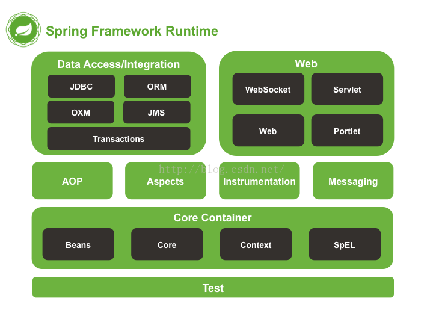

# Spring Bean

Spring 依赖注入 Bean 实例默认是单例的，我们由此展开。

Spring 的依赖注入（包括 lazy-init 方式）都是发生在 AbstractBeanFactory 的 getBean 里。getBean 的 doGetBean 方法调用 getSingleton 进行 bean 的创建。lazy-init 方式，在容器初始化时候进行调用，非 lazy-init 方式，在用户向容器第一次索要 bean 时进行调用

```java

/**
     * Return the (raw) singleton object registered under the given name.
     * <p>Checks already instantiated singletons and also allows for an early
     * reference to a currently created singleton (resolving a circular reference).
     * @param beanName the name of the bean to look for
     * @param allowEarlyReference whether early references should be created or not
     * @return the registered singleton object, or {@code null} if none found
     */
    protected Object getSingleton(String beanName, boolean allowEarlyReference) {
        Object singletonObject = this.singletonObjects.get(beanName);
        if (singletonObject == null && isSingletonCurrentlyInCreation(beanName)) {
            synchronized (this.singletonObjects) {
                singletonObject = this.earlySingletonObjects.get(beanName);
                if (singletonObject == null && allowEarlyReference) {
                    ObjectFactory<?> singletonFactory = this.singletonFactories.get(beanName);
                    if (singletonFactory != null) {
                        singletonObject = singletonFactory.getObject();
                        this.earlySingletonObjects.put(beanName, singletonObject);
                        this.singletonFactories.remove(beanName);
                    }
                }
            }
        }
        return (singletonObject != NULL_OBJECT ? singletonObject : null);
    }
```

## spring 概述

Spring 框架是一个轻量级的解决方案，可以一站式地构建企业级应用。Spring 是模块化的，所以可以只使用其中需要的部分。可以在任何 web 框架上使用控制反转（IoC），也可以只使用 Hibernate 集成代码或 JDBC 抽象层。它支持声明式事务管理、通过 RMI 或 web 服务实现远程访问，并可以使用多种方式持久化数据。它提供了功能全面的 MVC 框架，可以透明地集成 AOP 到软件中。

Spring 被设计为非侵入式的，这意味着你的域逻辑代码通常不会依赖于框架本身。在集成层（比如数据访问层），会存在一些依赖同时依赖于数据访问技术和 Spring，但是这些依赖可以很容易地从代码库中分离出来。

Spring 可以使用 POJO（普通的 Java 对象，plain old java objects）创建应用，并且可以将企业服务非侵入式地应用到 POJO。这项功能适用于 Java SE 编程模型以及全部或部分的 Java EE。

那么，做为开发者可以从 Spring 获得哪些好处呢？

- 不用关心事务 API 就可以执行数据库事务；
- 不用关心远程 API 就可以使用远程操作；
- 不用关心 JMX API 就可以进行管理操作；
- 不用关心 JMS API 就可以进行消息处理。
  > 译者注：①JMX，Java Management eXtension，Java 管理扩展，是一个为应用程序、设备、系统等植入管理功能的框架。JMX 可以跨越一系列异构操作系统平台、系统体系结构和网络传输协议，灵活的开发无缝集成的系统、网络和服务管理应用。②JMS，Java Message Service，Java 消息服务，是 Java 平台上有关面向消息中间件(MOM)的技术规范，它便于消息系统中的 Java 应用程序进行消息交换,并且通过提供标准的产生、发送、接收消息的接口简化企业应用的开发。

### 依赖注入（DI）和控制反转（IoC）

一个 Java 应用程序，从受限制的嵌入式应用到 n 层的服务端应用，典型地是由相互合作的对象组成的，因此，一个应用程序中的对象是相互依赖的。

Java 平台虽然提供了丰富的应用开发功能，但是它并没有把这些基础构建模块组织成连续的整体，而是把这项任务留给了架构师和开发者。你可以使用设计模式，比如工厂模式、抽象工厂模式、创建者模式、装饰者模式以及服务定位器模式等，来构建各种各样的类和对象实例，从而组成整个应用程序。这些设计模式是很简单的，关键在于它们根据最佳实践起了很好的名字，它们的名字可以很好地描述它们是干什么的、用于什么地方、解决什么问题，等等。这些设计模式都是最佳实践的结晶，所以你应该在你的应用程序中使用它们。

Spring 的控制反转解决了上述问题，它提供了一种正式的解决方案，你可以把不相干组件组合在一起，从而组成一个完整的可以使用的应用。Spring 根据设计模式编码出了非常优秀的代码，所以可以直接集成到自己的应用中。因此，大量的组织机构都使用 Spring 来保证应用程序的健壮性和可维护性。

### spring 模块

Spring 大约包含了 20 个模块，这些模块组成了核心容器（Core Container）、数据访问/集成（Data Access/Integration）、Web、AOP（面向切面编程，Aspect Oriented Programming）、Instrumentation、消息处理（Messaging）和测试（Test），


#### 核心容器（Core Container）

核心容器包括 spring-core，spring-beans，spring-context，spring-context-support 和 spring-expression（SpEL，Spring 表达式语言，Spring Expression Language）等模块。

spring-core 和 spring-beans 模块是 Spring 框架的基础，包括控制反转和依赖注入等功能。BeanFactory 是工厂模式的微妙实现，它移除了编码式单例的需要，并且可以把配置和依赖从实际编码逻辑中解耦。

Context（spring-context）模块是在 Core 和 Bean 模块的基础上建立起来的，它以一种类似于 JNDI 注册的方式访问对象。Context 模块继承自 Bean 模块，并且添加了国际化（比如，使用资源束）、事件传播、资源加载和透明地创建上下文（比如，通过 Servelet 容器）等功能。Context 模块也支持 Java EE 的功能，比如 EJB、JMX 和远程调用等。ApplicationContext 接口是 Context 模块的焦点。spring-context-support 提供了对第三方库集成到 Spring 上下文的支持，比如缓存（EhCache, Guava, JCache）、邮件（JavaMail）、调度（CommonJ, Quartz）、模板引擎（FreeMarker, JasperReports, Velocity）等。

spring-expression 模块提供了强大的表达式语言用于在运行时查询和操作对象图。它是 JSP2.1 规范中定义的统一表达式语言的扩展，支持 set 和 get 属性值、属性赋值、方法调用、访问数组集合及索引的内容、逻辑算术运算、命名变量、通过名字从 Spring IoC 容器检索对象，还支持列表的投影、选择以及聚合等。

#### AOP 和检测（Instrumentation）

spring-aop 模块提供了面向切面编程（AOP）的实现，可以定义诸如方法拦截器和切入点等，从而使实现功能的代码彻底的解耦出来。使用源码级的元数据，可以用类似于.Net 属性的方式合并行为信息到代码中。

spring-aspects 模块提供了对 AspectJ 的集成。

spring-instrument 模块提供了对检测类的支持和用于特定的应用服务器的类加载器的实现。spring-instrument-tomcat 模块包含了用于 tomcat 的 Spring 检测代理。

#### 消息处理（messaging）

Spring 4 包含的 spring-messaging 模块是从 Spring 集成项目的关键抽象中提取出来的，这些项目包括 Message、MessageChannel、MessageHandler 和其它服务于消息处理的项目。这个模块也包含一系列的注解用于映射消息到方法，这类似于 Spring MVC 基于编码模型的注解。

#### 数据访问与集成

数据访问与集成层包含 JDBC、ORM、OXM、JMS 和事务模块。
（译者注：JDBC=Java Data Base Connectivity，ORM=Object Relational Mapping，OXM=Object XML Mapping，JMS=Java Message Service）

spring-jdbc 模块提供了 JDBC 抽象层，它消除了冗长的 JDBC 编码和对数据库供应商特定错误代码的解析。

spring-tx 模块支持编程式事务和声明式事务，可用于实现了特定接口的类和所有的 POJO 对象。
（译者注：编程式事务需要自己写 beginTransaction()、commit()、rollback()等事务管理方法，声明式事务是通过注解或配置由 spring 自动处理，编程式事务粒度更细）

spring-orm 模块提供了对流行的对象关系映射 API 的集成，包括 JPA、JDO 和 Hibernate 等。通过此模块可以让这些 ORM 框架和 spring 的其它功能整合，比如前面提及的事务管理。

spring-oxm 模块提供了对 OXM 实现的支持，比如 JAXB、Castor、XML Beans、JiBX、XStream 等。

spring-jms 模块包含生产（produce）和消费（consume）消息的功能。从 Spring 4.1 开始，集成了 spring-messaging 模块。

#### Web

Web 层包括 spring-web、spring-webmvc、spring-websocket、spring-webmvc-portlet 等模块。

spring-web 模块提供面向 web 的基本功能和面向 web 的应用上下文，比如多部分（multipart）文件上传功能、使用 Servlet 监听器初始化 IoC 容器等。它还包括 HTTP 客户端以及 Spring 远程调用中与 web 相关的部分。

spring-webmvc 模块（即 Web-Servlet 模块）为 web 应用提供了模型视图控制（MVC）和 REST Web 服务的实现。Spring 的 MVC 框架可以使领域模型代码和 web 表单完全地分离，且可以与 Spring 框架的其它所有功能进行集成。

spring-webmvc-portlet 模块（即 Web-Portlet 模块）提供了用于 Portlet 环境的 MVC 实现，并反映了 spring-webmvc 模块的功能。

#### Test

spring-test 模块通过 JUnit 和 TestNG 组件支持单元测试和集成测试。它提供了一致性地加载和缓存 Spring 上下文，也提供了用于单独测试代码的模拟对象（mock object）。

#### Groovy Bean 定义 DSL

从 Spring 4.0 开始，可以使用 Groovy DSL 定义外部 bean 了。在概念上，这与使用 XML 配置 bean 类似，但是可以使用更简洁的语法。使用 Groovy 还可以很容易地把 bean 定义直接嵌入到引导代码中。例如：

```groovy

def reader = new GroovyBeanDefinitionReader(myApplicationContext)
reader.beans {
    dataSource(BasicDataSource) {
        driverClassName = "org.hsqldb.jdbcDriver"
        url = "jdbc:hsqldb:mem:grailsDB"
        username = "sa"
        password = ""
        settings = [mynew:"setting"]
    }
    sessionFactory(SessionFactory) {
        dataSource = dataSource
    }
    myService(MyService) {
        nestedBean = { AnotherBean bean ->
            dataSource = dataSource
        }
    }
}
```
