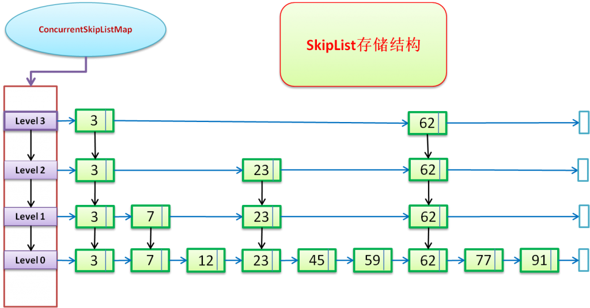

# ten written java

## 我招聘初中级 Java 工程师的 10 个笔试题目

1. Integer a = 16,Integer b = 16，请输出 a == b 和 a.equals(b)的结果
2. 实现 String 的 hashcode 方法
3. 实现将一个 int 转为 byte[]
4. HashMap、LinkedHashMap、TreeMap 区别
5. ConcurrentSkipListMap 是做什么的
6. 列举 JDK 类库中用到的设计模式，列举越多越好
7. 请说出程序的运行结果

   ```java
   List<String> list = new ArrayList<>();
   list.add("1");
   list.add("2");

   for (String str : list) {
      if ("1".equals(str)) {
          list.remove(str);
      }
   }

   System.out.println(list);
   ```

8. 实现一个线程安全的单例(可写出多种实现方式，越多越好)
9. 写出 ThreadPoolExecutor 的构造函数
10. 伪代码实现 LinkedBlockingQueue 的 put 和 take

## 简单剖析一下

1. 比较基础的问题，但是坑在于'IntegerCache' (true,true) Integer ,Short ,Long 都有类似的 Cache 缓存-128~127 的数据,最大 cahe 值是可以通过选项参数调整的

```java
    /**
     * Returns an {@code Integer} instance representing the specified
     * {@code int} value.  If a new {@code Integer} instance is not
     * required, this method should generally be used in preference to
     * the constructor {@link #Integer(int)}, as this method is likely
     * to yield significantly better space and time performance by
     * caching frequently requested values.
     *
     * This method will always cache values in the range -128 to 127,
     * inclusive, and may cache other values outside of this range.
     *
     * @param  i an {@code int} value.
     * @return an {@code Integer} instance representing {@code i}.
     * @since  1.5
     */
    public static Integer valueOf(int i) {
        if (i >= IntegerCache.low && i <= IntegerCache.high)
            return IntegerCache.cache[i + (-IntegerCache.low)];
        return new Integer(i);
    }

     /**
     * Cache to support the object identity semantics of autoboxing for values between
     * -128 and 127 (inclusive) as required by JLS.
     *
     * The cache is initialized on first usage.  The size of the cache
     * may be controlled by the {@code -XX:AutoBoxCacheMax=<size>} option.
     * During VM initialization, java.lang.Integer.IntegerCache.high property
     * may be set and saved in the private system properties in the
     * sun.misc.VM class.
     */

    private static class IntegerCache {}
```

2. 一个基础扎实的 Java 程序员如果不知道经典的 String 的 hashcode 实现，那真得应该去补补 effective Java 了

```java
    /**
     * Returns a hash code for this string. The hash code for a
     * {@code String} object is computed as
     * <blockquote><pre>
     * s[0]*31^(n-1) + s[1]*31^(n-2) + ... + s[n-1]
     * </pre></blockquote>
     * using {@code int} arithmetic, where {@code s[i]} is the
     * <i>i</i>th character of the string, {@code n} is the length of
     * the string, and {@code ^} indicates exponentiation.
     * (The hash value of the empty string is zero.)
     * 31是一个不大不小的质数，是作为 hashCode 乘子的优选质数之一
     * 31可以被 JVM 优化，31 * i = (i << 5) - i
     * 可以降低哈希算法的冲突率,太大会出现int溢出 int 类型表示哈希值，结果会溢出
     *
     * 选择数字31是因为它是一个奇质数，如果选择一个偶数会在乘法运算中产生溢出，
     * 导致数值信息丢失，因为乘二相当于移位运算。选择质数的优势并不是特别的明显，
     * 但这是一个传统。同时，数字31有一个很好的特性，即乘法运算可以被移位和减法运算取代，
     * 来获取更好的性能：31 * i == (i << 5) - i，现代的 Java 虚拟机可以自动的完成这个优化。
     * @return  a hash code value for this object.
     * 参考 https://segmentfault.com/a/1190000010799123
     */
    public int hashCode() {
        int h = hash;
        if (h == 0 && value.length > 0) {
            char val[] = value;

            for (int i = 0; i < value.length; i++) {
                h = 31 * h + val[i];
            }
            hash = h;
        }
        return h;
    }
```

3. 这个考察程序员对于底层的'位运算基础'

**一个 int 有 4 个八位，也就是 4 个字节**

```java
/**
	 * int转byte数组
	 * @param bytes
	 * @return
	 */
	public byte[]IntToByte(int num){
		byte[]bytes=new byte[4];
		bytes[0]=(byte) ((num>>24)&0xff);
		bytes[1]=(byte) ((num>>16)&0xff);
		bytes[2]=(byte) ((num>>8)&0xff);
		bytes[3]=(byte) (num&0xff);
		return bytes;
	}

    /**
	 * byte数组转int类型的对象
	 * @param bytes
	 * @return
	 */
	public int Byte2Int(Byte[]bytes) {
		return (bytes[0]&0xff)<<24
			| (bytes[1]&0xff)<<16
			| (bytes[2]&0xff)<<8
			| (bytes[3]&0xff);
	}
```

因为一个 byte 是八位，int 有四个八位，所以将这个 byte[0]左移 24 位，就将这个 byte[0]放在了 int 的最高一个八位上。
同理,byte[1]放置在第二个八位上,byte[2]放置在第三个八位上，byte[3]放置在第四个八位上。

首先 0xff 是十六进制的 255，也就是二进制的 1111 1111，对 0xff 取与，实际上就是要取这个数最低八位的值，截一个字节的长度
如果不用&0xff，那么在进行负数的运算时就会出现问题

4. 考察 Java 基本的数据结构

HashMap 里面存入的键值对在取出的时候是随机的,它根据键的 HashCode 值存储数据,根据键可以直接获取它的值，具有很快的访问速度。在 Map 中插入、删除和定位元素，HashMap 是最好的选择。
TreeMap 取出来的是排序后的键值对。但如果您要按自然顺序或自定义顺序遍历键，那么 TreeMap 会更好。
LinkedHashMap 是 HashMap 的一个子类，如果需要输出的顺序和输入的相同,那么用 LinkedHashMap 可以实现,它还可以按读取顺序来排列，像连接池中可以应用。

5. 这个很多程序员可能没用过，如果用过或者了解，那么是加分项

   1. ConcurrentSkipListMap 是线程安全的有序的哈希表，适用于高并发的场景。
   2. ConcurrentSkipListMap 和 TreeMap，它们虽然都是有序的哈希表。但是，
      第一 它们的线程安全机制不同，TreeMap 是非线程安全的，而 ConcurrentSkipListMap 是线程安全的。
      第二，ConcurrentSkipListMap 是通过跳表实现的，而 TreeMap 是通过红黑树实现的。
   3. 关于跳表(Skip List)，它是平衡树的一种替代的数据结构，但是和红黑树不相同的是，跳表对于树的平衡的实现是基于一种随机化的算法的，这样也就是说跳表的插入和删除的工作是比较简单的。

   #### 什么是 skip list

   Skip list(跳表）是一种可以代替平衡树的数据结构，默认是按照 Key 值升序的。Skip list 让已排序的数据分布在多层链表中，以 0-1 随机数决定一个数据的向上攀升与否，通过“空间来换取时间”的一个算法，在每个节点中增加了向前的指针，在插入、删除、查找时可以忽略一些不可能涉及到的结点，从而提高了效率。

   
   **Skip list 的性质**

   1. 由很多层结构组成，level 是通过一定的概率随机产生的。
   2. 每一层都是一个有序的链表，默认是升序，也可以根据创建映射时所提供的 Comparator 进行排序，具体取决于使用的构造方法。
   3. 最底层(Level 1)的链表包含所有元素。
   4. 如果一个元素出现在 Level i 的链表中，则它在 Level i 之下的链表也都会出现。
   5. 每个节点包含两个指针，一个指向同一链表中的下一个元素，一个指向下面一层的元素。

   
   跳跃表（SkipList）：（如上图所示）

   1. 多条链构成，是关键字升序排列的数据结构；
   2. 包含多个级别，一个 head 引用指向最高的级别，最低（底部）的级别，包含所有的 key；
   3. 每一个级别都是其更低级别的子集，并且是有序的；
   4. 如果关键字 key 在 级别 level=i 中出现，则，level<=i 的链表中都会包含该关键字 key；
      
      红色虚线，表示查找的路径，蓝色向右箭头表示 right 引用；黑色向下箭头表示 down 引用；

6. 这个和编程相关了，是否对于 oop 和模式有一定的了解

   #### jdk 中的设计模式

   1. Singleton（单例）
      作用：保证类只有一个实例；提供一个全局访问点
      JDK 中体现：
      （1）Runtime
      （2）NumberFormat
   2. Factory（静态工厂）
      作用：
      （1）代替构造函数创建对象
      （2）方法名比构造函数清晰
      JDK 中体现：
      （1）Integer.valueOf
      （2）Class.forName
   3. Factory Method（工厂方法）
      作用：子类决定哪一个类实例化
      JDK 中体现：Collection.iterator 方法
   4. Abstract Factory（抽象工厂）
      作用：创建某一种类的对象
      JDK 中体现：
      （1）java.sql 包
      （2）UIManager（swing 外观）
   5. Builder（构造者）
      作用：
      （1）将构造逻辑提到单独的类中
      （2）分离类的构造逻辑和表现
   6. Prototype（原型）
      作用：
      （1）复制对象
      （2）浅复制、深复制
      JDK 中体现：Object.clone；Cloneable
   7. Adapter（适配器）
      作用：使不兼容的接口相容
      JDK 中体现：
      （1）java.io.InputStreamReader(InputStream)
      （2）java.io.OutputStreamWriter(OutputStream)
   8. 代理模式
      代理模式是用一个简单的对象来代替一个复杂的或者创建耗时的对象。
      java.lang.reflect.Proxy
      RMI

7. 这个问题看似简单，其实有坑，是否能彻底理解`ConcurrentModificationException`

   ```java
    List<String> list = new ArrayList<>();
    list.add("1");
    list.add("2");

    for (String str : list) {
       if ("1".equals(str)) {
           list.remove(str);
       }
    }

    System.out.println(list); // [2]
    System.out.println(list);
   ;
        list1.add(2);
        Iterator<Integer> iterator = list1.iterator();
        while(iterator.hasNext()){
            Integer integer = iterator.next();//第二次执行异常
            if(integer==2)
                list1.remove(integer);
        }
    list = new ArrayList<Integer>();
        list.add(2);
        Iterator<Integer> iterator = list.iterator();
        while(iterator.hasNext()){
            Integer integer = iterator.next();
            if(integer==2)
                iterator.remove();   //注意这个地方，单线程下没问题
            // 多线程下
            // 1）在使用iterator迭代的时候使用synchronized或者Lock进行同步；
        　　//  2）使用并发容器CopyOnWriteArrayList代替ArrayList和Vector。
        }
   ```

   1. cursor：表示下一个要访问的元素的索引，从 next()方法的具体实现就可看出
   2. lastRet：表示上一个访问的元素的索引
   3. expectedModCount：表示对 ArrayList 修改次数的期望值，它的初始值为 modCount。
   4. modCount 是 AbstractList 类中的一个成员变量

   分析第一段执行，先取到 1 字符串 1 与之内容相等，从 list 中 remove 成功，第二次 hasNext 方法 `cursor =1, size =1 hasNext = false`
   直接 return 了 ,并不会发生 ConcurrentModificationException
   第二段执行，第一次 hasNext = true ，取出 2 ，remove ok ，第二次 hasNext = false 因为 此时 cursor =1 ，size =0
   接着 iterator.next() 检查 checkForComodification 不相等跑出异常 ConcurrentModificationException

8. 比较基础，但是能看出很多东西，如‘double-checked’，enum，static holder

```java
public class Runtime { // 非线程安全？
    private static Runtime currentRuntime = new Runtime();

    public static Runtime getRuntime() {
        return currentRuntime;
    }

    /** Don't let anyone else instantiate this class */
    private Runtime() {}
}

 //双重检查锁
  public final class DoubleCheckedSingleton
  { // new的时候如果比较耗时，还是会有问题
    private static DoubleCheckedSingletonsingObj = null;

    private DoubleCheckedSingleton(){
    }

    public static DoubleCheckedSingleton getSingleInstance(){
        if(null == singObj ) {
            Synchronized(DoubleCheckedSingleton.class){
                    if(null == singObj)
                        singObj = new DoubleCheckedSingleton();
            }
        }
    return singObj；
    }
 }

public class Singleton {  //1.懒汉型
    private static Singleton instance;
    private Singleton (){}
    public static synchronized Singleton getInstance() {
    if (instance == null) {
        instance = new Singleton();
    }
    return instance;
    }
}
  //Initialization on Demand Holder
  public class Singleton
  {
      private static class SingletonHolder
      {
          public final static Singleton instance = new Singleton();
      }
      private Singleton(){}
      public static Singleton getInstance()
     {
         return SingletonHolder.instance;
     }
 }

public enum SingletonEnum { //5.枚举型，Effective Java作者提倡的。可防止反序列化

	INSTANCE;

	public SingletonEnum getInstance(){
		return INSTANCE;
	}
}
```

9. 多线程的基础，需要了解线程池的实现原理和建议使用方式

```java
/五个参数的构造函数
public ThreadPoolExecutor(int corePoolSize,
                          int maximumPoolSize,
                          long keepAliveTime,
                          TimeUnit unit,
                          BlockingQueue<Runnable> workQueue)

//六个参数的构造函数-1
public ThreadPoolExecutor(int corePoolSize,
                          int maximumPoolSize,
                          long keepAliveTime,
                          TimeUnit unit,
                          BlockingQueue<Runnable> workQueue,
                          ThreadFactory threadFactory)

//六个参数的构造函数-2
public ThreadPoolExecutor(int corePoolSize,
                          int maximumPoolSize,
                          long keepAliveTime,
                          TimeUnit unit,
                          BlockingQueue<Runnable> workQueue,
                          RejectedExecutionHandler handler)

//七个参数的构造函数
public ThreadPoolExecutor(int corePoolSize,
                          int maximumPoolSize,
                          long keepAliveTime,
                          TimeUnit unit,
                          BlockingQueue<Runnable> workQueue,
                          ThreadFactory threadFactory,
                          RejectedExecutionHandler handler)

```

- int corePoolSize：该线程池中核心线程数最大值
  核心线程：线程池新建线程的时候，如果当前线程总数小于 corePoolSize，则新建的是核心线程，如果超过 corePoolSize，则新建的是非核心线程核心线程默认情况下会一直存活在线程池中，即使这个核心线程啥也不干(闲置状态)。
  如果指定 ThreadPoolExecutor 的 allowCoreThreadTimeOut 这个属性为 true，那么核心线程如果不干活(闲置状态)的话，超过一定时间(时长下面参数决定)，就会被销毁掉。

- int maximumPoolSize： 该线程池中线程总数最大值
  线程总数 = 核心线程数 + 非核心线程数。

- long keepAliveTime：该线程池中非核心线程闲置超时时长
  一个非核心线程，如果不干活(闲置状态)的时长超过这个参数所设定的时长，就会被销毁掉，如果设置 allowCoreThreadTimeOut = true，则会作用于核心线程。

- TimeUnit unit：keepAliveTime 的单位
  TimeUnit 是一个枚举类型，其包括：
  NANOSECONDS ： 1 微毫秒 = 1 微秒 / 1000
  MICROSECONDS ： 1 微秒 = 1 毫秒 / 1000
  MILLISECONDS ： 1 毫秒 = 1 秒 /1000
  SECONDS ： 秒
  MINUTES ： 分
  HOURS ： 小时
  DAYS ： 天

- BlockingQueue workQueue：该线程池中的任务队列：维护着等待执行的 Runnable 对象
  当所有的核心线程都在干活时，新添加的任务会被添加到这个队列中等待处理，如果队列满了，则新建非核心线程执行任务。
  常用的 workQueue 类型：

- SynchronousQueue：这个队列接收到任务的时候，会直接提交给线程处理，而不保留它，如果所有线程都在工作怎么办？那就新建一个线程来处理这个任务！所以为了保证不出现<线程数达到了 maximumPoolSize 而不能新建线程>的错误，使用这个类型队列的时候，maximumPoolSize 一般指定成 Integer.MAX_VALUE，即无限大

- LinkedBlockingQueue：这个队列接收到任务的时候，如果当前线程数小于核心线程数，则新建线程(核心线程)处理任务；如果当前线程数等于核心线程数，则进入队列等待。由于这个队列没有最大值限制，即所有超过核心线程数的任务都将被添加到队列中，这也就导致了 maximumPoolSize 的设定失效，因为总线程数永远不会超过 corePoolSize

- ArrayBlockingQueue：可以限定队列的长度，接收到任务的时候，如果没有达到 corePoolSize 的值，则新建线程(核心线程)执行任务，如果达到了，则入队等候，如果队列已满，则新建线程(非核心线程)执行任务，又如果总线程数到了 maximumPoolSize，并且队列也满了，则发生错误

- DelayQueue：队列内元素必须实现 Delayed 接口，这就意味着你传进去的任务必须先实现 Delayed 接口。这个队列接收到任务时，首先先入队，只有达到了指定的延时时间，才会执行任务

- ThreadFactory threadFactory：创建线程的方式，这是一个接口，你 new 他的时候需要实现他的 Thread newThread(Runnable r)方法，一般用不上。

- RejectedExecutionHandler handler：这玩意儿就是抛出异常专用的，比如上面提到的两个错误发生了，就会由这个 handler 抛出异常，根本用不上。

10. 多线程的一个运用，线程之间同步、锁分离等
    LinkedBlockingQueue 顾名思义这是一个阻塞的线程安全的队列，底层应该采用链表实现。看其 API 的时候发现，添加元素的方法竟然有三个：add,put,offer。且这三个方法都是向队列尾部添加元素的意思

- add 方法在添加元素的时候，若超出了度列的长度会直接抛出异常：
- 对于 put 方法，若向队尾添加元素的时候发现队列已经满了会发生阻塞一直等待空间，以加入元素。
- offer 方法在添加元素时，如果发现队列已满无法添加的话，会直接返回 false。
  从队列中取出并移除头元素的方法有：poll，remove，take。
- poll: 若队列为空，返回 null。
- remove:若队列为空，抛出 NoSuchElementException 异常。
- take:若队列为空，发生阻塞，等待有元素。

```java
public void put(E e) throws InterruptedException {
    if (e == null) throw new NullPointerException(); // 不允许空元素
    int c = -1;
    Node<E> node = new Node(e); // 以新元素构造节点
    final ReentrantLock putLock = this.putLock;
    final AtomicInteger count = this.count;
    putLock.lockInterruptibly(); // 放锁加锁，保证调用put方法的时候只有1个线程
    try {
        while (count.get() == capacity) { // 如果容量满了
            notFull.await(); // 阻塞并挂起当前线程
        }
        enqueue(node); // 节点添加到链表尾部
        c = count.getAndIncrement(); // 元素个数+1
        if (c + 1 < capacity) // 如果容量还没满
            notFull.signal(); // 在放锁的条件对象notFull上唤醒正在等待的线程，表示可以再次往队列里面加数据了，队列还没满
    } finally {
        putLock.unlock(); // 释放放锁，让其他线程可以调用put方法
    }
    if (c == 0) // 由于存在放锁和拿锁，这里可能拿锁一直在消费数据，count会变化。这里的if条件表示如果队列中还有1条数据
        signalNotEmpty(); // 在拿锁的条件对象notEmpty上唤醒正在等待的1个线程，表示队列里还有1条数据，可以进行消费
}

public E take() throws InterruptedException {
    E x;
    int c = -1;
    final AtomicInteger count = this.count;
    final ReentrantLock takeLock = this.takeLock;
    takeLock.lockInterruptibly(); // 拿锁加锁，保证调用take方法的时候只有1个线程
    try {
        while (count.get() == 0) { // 如果队列里已经没有元素了
            notEmpty.await(); // 阻塞并挂起当前线程
        }
        x = dequeue(); // 删除头结点
        c = count.getAndDecrement(); // 元素个数-1
        if (c > 1) // 如果队列里还有元素
            notEmpty.signal(); // 在拿锁的条件对象notEmpty上唤醒正在等待的线程，表示队列里还有数据，可以再次消费
    } finally {
        takeLock.unlock(); // 释放拿锁，让其他线程可以调用take方法
    }
    if (c == capacity) // 由于存在放锁和拿锁，这里可能放锁一直在添加数据，count会变化。这里的if条件表示如果队列中还可以再插入数据
        signalNotFull(); // 在放锁的条件对象notFull上唤醒正在等待的1个线程，表示队列里还能再次添加数据
    return x;
}
```

## 我的评分和评价

1. 我出的这些题目主要考察 Java 基础，因为一个好的程序员，基础是非常重要的
2. 如果 10 个题目能拿 60 分，那说明及格了；如果 80 分以上，那很优秀，如果全部都答的不错，那么说明你非常不错了
