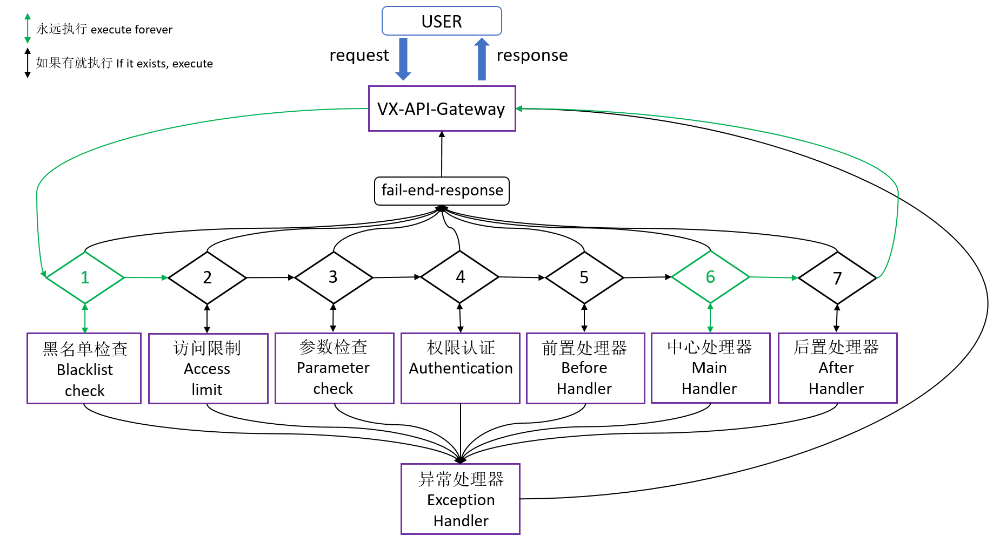

# [VX-API-Gateway](https://duhua.gitee.io/vx-api-gateway-doc/) 一个基于 vert.x 实现的[API Gateway](https://github.com/EliMirren/VX-API-Gateway)

## 简单介绍 VX-API-Gateway

一个集分布式、高性能、可扩展、轻量级的全异步 API 网关
是基于 Vert.x 3.5.1(java)开发的 API 网关,是一个分布式、全异步、高性能、可扩展、轻量级的 API 网关

## API Gateway

是客户端访问微服务应用的大门。每个由客户端发出的请求都先达到 API Gateway，然后经其处理后分发至对应的 REST 端点。听起来像是个简单的反向代理组件？不错，但它又不仅仅是一个反向代理组件。它也负责进行负载均衡，权限认证以及处理错误。并且如果服务的协议与 HTTP 协议不兼容的话，它还负责服务协议的对接与适配。API Gateway 可以与服务发现组件结合，因此我们不必担心底层服务位置的变动。

API Gateway 如此重要，因此如果引入它的话，必须保证其高可用性，这也需要仔细思考。并且，如果 API Gateway 设计的不合理的话，会成为系统性能的瓶颈。不过除了这些点之外，我们没有理由不用 API Gateway。

## API

API 是 VX-API 的服务核心,创建应用后便可以在应用的 API 管理中创建 API;
当前版本中 API 支持三种服务类型,

- HTTP/HTTPS 服务(既 VX-API 需要去请到后台服务器的类型):参数检查与透传,支持带权重的负载均衡访问策略,轮询与 IP 哈希化,自动断路与重试不可用的后台服务地址
- 页面跳转服务:当用户访问时 redirect 到指定页面
- 自定义服务:可以自定义任意服务,当前版本中实现了,基于 session-token 的认证授权,获取服务器时间戳,与获取常量
  同时 API 支持全局黑名单,流量限制,权限认证,自定义前置/后置处理器等

## API 的执行流程

 
绿线代表一定会执行,黑线代表当存在时执行,当用户请求的时候,完整的流程按组件顺序由 1 开始执行到 7,如果不满足任意一个组件时请求结束并响应(fail-end-response),当任意组件出现异常时统一进入异常组件(Exception Handler)请求结束并响应错误信息
 
API 的执行流程参考组件介绍

## 组件介绍

### 1.黑名单检查

该组件永远会被执行! 用户请求时第一步先经过黑名单检查,VX-API 会读取请求中的 remote Address 并获取用户的 host(也就是获取用户的 IP 地址),如果用户的 IP 地址在全局黑名单中,结束请求并响应状态码:404,状态信息:you can't access this service;反则继续执行处理...

### 2.访问限制

当创建 API 时开启了访问限制,该组件会被执行! 访问限制单位分别为:天/小时/分;可以设置 API 与 IP 限制,IP 的限制不能大于 API 的限制; 
假设开启 API 限制:1 分钟可以访问 1000 次;如果 1 分钟内访问次数大于 1000 将结束请求并响应请求(响应内容为:创建 API 中定义 API 返回结果:访问限制返回);反则继续执行处理...

### 3.参数检查

当创建 API 时如果在定义 API 请求中添加了入参定义,该组件会被执行! 组件会根据入参定义规定的格式检查请求中的参数; 
如果参数不符合入参定义结束请求并响应请求(响应内容为:创建 API 中定义 API 返回结果:网关入口参数检查失败返回);反则继续执行处理...

### 4.权限认证

当创建 API 时开启了安全认证,该组件会被执行! 组件会将流程交给权限认证插件,权限认证插件负责做相关处理后决定将流程交给下一个组件处理或结束请求

### 5.前置处理器

当创建 API 时开启了前置处理器,该组件会被执行! 组件会将流程交给前置处理器插件,前置处理器插件负责做相关处理后决定将流程交给下一个组件处理或结束请求

### 6.中心处理器(主处理器)

当前面的组件都执行通过时,该组件永远会被执行! 组件会根据服务类型做相应的处理,处理完毕后组件会判断是否开启了后置处理器,如果开启了后置处理器,组件会将流程交给后置处理器,并传递一个标识告诉后置处理器当前组件处理的结果;反则结束请求并返回服务结果;

### 7.后置处理器

当创建 API 时开启了后置处理器,该组件会被执行! 该组件是正常流程的最后一个组件,组件会收到主处理器的执行结果,组件做完相应操作后必须做对请求的响应用户的请求;

### 8.异常处理器

当以上任意组件在执行的过程中出现了异常,该组件会被执行! 组件会结束请求并响应请求(响应内容为:创建 API 中定义 API 返回结果:发生异常/失败返回);

## 服务类型介绍

服务类型指网关主处理器要处理的类型,详情参考类型以下的介绍

### HTTP/HTTPS

表示后台服务是常见的 HTTP/HTTPS,也就是网关要将用户的请求发送的目的地,该服务支持带权重的负载均衡支持轮询与哈希策略(默认轮询),自动断路并重试连接;当网关请求后台服务地址失败时会提交给策略,如果同一个服务地址失败两次及以上时,会被策略移除,网关会检测策略中是否存在不可用的服务地址,如果存在会根据设定的重试时间进行重试,重试后如果服务地址可用则将服务地址重新添加到策略中

### 页面跳转

该服务用于做链接重定向,当用户请求该服务的 API 时会,网关会返回状态 302,告诉浏览器跳转到指定的 URL;

### 自定义服务

自定义服务其实跟前置处理器实现的功能差不多,因为前置处理器可以做完相应处理后响应用户请求,自定义服务中提供了三个默认的实现,分别为获取网关时间戳,返回常量值与 Session 认证的授权

## 全局黑名单

黑名单对象是用户 IP 地址,当用户请求 VX-API 时第一步先经过黑名单检查,VX-API 会读取请求中的 remote Address 并获取用户的 host(也就是获取用户的 IP 地址),如果用户的 IP 地址在全局黑名单中,结束请求并响应状态码:404,状态信息:you can't access this service;
