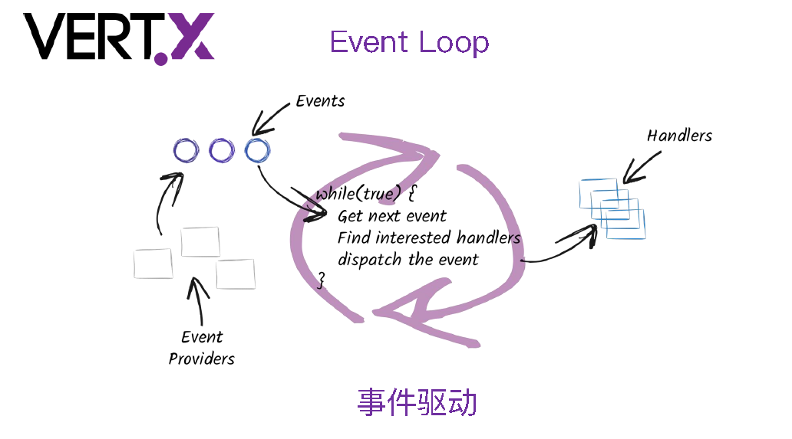
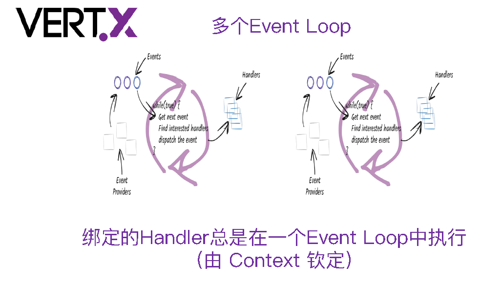
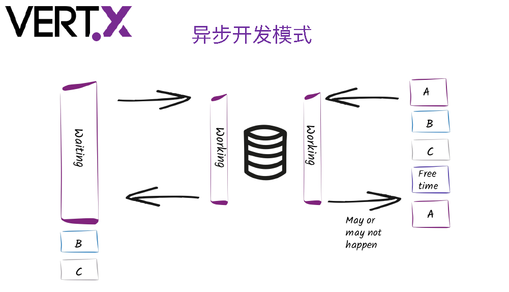
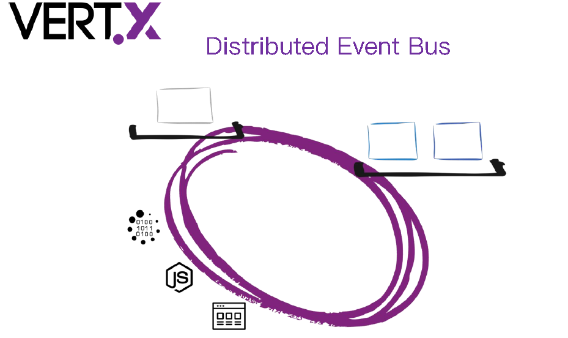
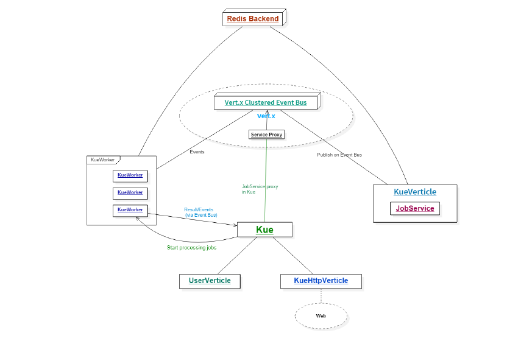
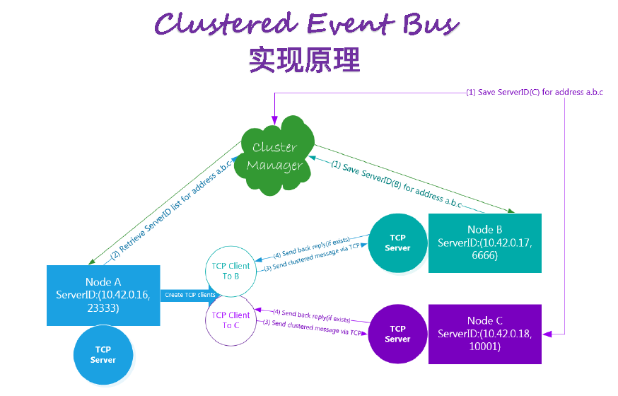
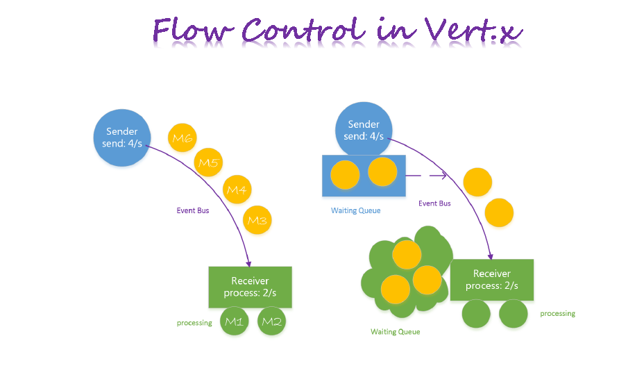
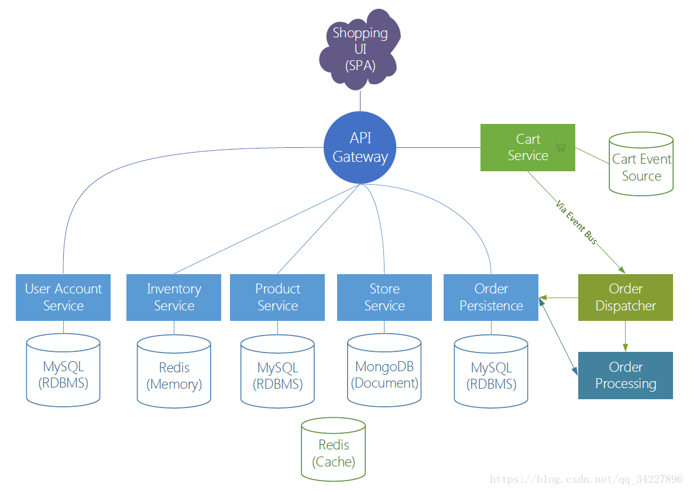
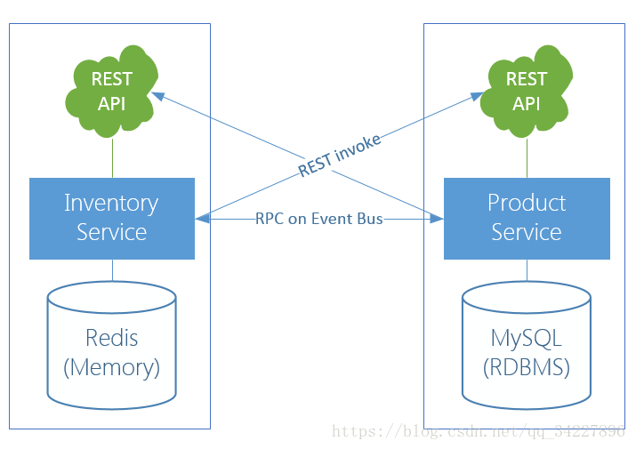

# [vert.x](https://github.com/vert-x3/)

[vertx-awesome](https://github.com/vert-x3/vertx-awesome)

Vert.x 诞生于 2011 年，当时叫 node.x，不过后来因为某些原因改名位 Vert.x。经过三年多的发展，现在已经到了 3.x 版本，社区也越来越活跃，在最新的官网 Vertx.io 上，作者用一句话介绍了它，JVM 上的 Reative 开发套件。Vert.x 目前是见过最功能最强大，第三方库依赖最少的 Java 框架，它只依赖 Netty4 以及 Jacskon，另外如果你需要建立分布式的 Vert.x 则再依赖 HazelCast 这个分布式框架，注意 Vert.x3 必须基于 Java8。由于基于 JVM，所以 Vert.x 可以用其他语言来实现你的业务。默认官方维护的语言是 Groovy，JavaScript 以及 JRuby。

Vert.x 是一个异步无阻塞的网络框架，其参照物是 node.js。基本上 node.js 能干的事情，Vert.x 都能干。Vert.x 利用 Netty4 的 EventLoop 来做单线程的事件循环，所以跑在 Vert.x 上的业务不能做 CPU 密集型的运算，这样会导致整个线程被阻塞。

**Vert.x 是基于事件的，提供一个事件驱动编程模型**，使用 Vert.x 作为服务器时，程序员只要编写事件处理器 event handler 即可. 当 TCP socket 有数据时，event handler 理解被创建调用，另外它还可以在以下几种情况激活： '当事件总线 Event Bus 接受到消息时,' '当接收到 HTTP 消息时,' 当一个连接断开时',' '当计时器超时时.'

作为服务层处理逻辑这一层基本上对应的传统 Java 里的领域模型处理层.各种 Service 调用,以及对数据层的调用.差不多是一个承上启下的一层.传统的模型里,这一层基本上都是同步调用,即使有异步调用,也是与业务逻辑分离的异步.如果全异步会导致业务逻辑碎乱.代码很难描述清楚.到这里你会发现 Vert.x 其实不太好融合到业务性很强的服务层里.其主要原因如下

- 1、自身是异步体系,不适合描述顺序逻辑性强的业务
- 2、由于异步的问题,访问数据层也必须是异步,导致业务模型进一步碎片化.

- 1、同时支持多种编程语言——目前已经支持了 Java、Scala、JavaScript、Ruby、Python、Groovy、Clojure、Ceylon 等。对程序员来说，直接好处就是可以使用各种语言丰富的 LIB，同时也不再为编程语言选型而纠结；

- 2、异步无锁编程——经典的多线程编程模型能满足很多 Web 开发场景，但随着移动互联网并发连接数的猛增，多线程并发控制模型性能难以扩展，同时要想控制好并发锁需要较高的技巧，目前 Reactor 异步编程模型开始跑马圈地，而 Vert.x 就是这种异步无锁编程的一个首选；

- 3、对各种 IO 的丰富支持——目前 Vert.x 的异步模型已支持 TCP、UDP、FileSystem、DNS、EventBus、Sockjs 等；

极好的分布式开发支持——Vert.x 通过 EventBus 事件总线，可以轻松编写分布式解耦的程序，具有很好的扩展性；

- 4、生态体系日趋成熟——Vert.x 归入 Eclipse 基金会门下，异步驱动已经支持了 Postgres、MySQL、MongoDB、Redis 等常用组件，并且有若干 Vert.x 在生产环境中的应用案例。

## Vert.x 提供的核心 API

- HTTP/HTTPS Server/Client
- Websocket SockJS
- TCP/SSL Server/Client
- UDP / DNS
- Files / Timer
- Json / Buffer / Flow Control
- EventBus ( 集群 )
- Distribution (Lock, Map, Counter)

- 开发模型/线程模型
- Verticle 之间进行通信: Event Bus
- 逻辑单元：Verticle(Actor-like)
- Event Loop 线程：处理事件（不能阻塞！）

## Worker 线程：可执行阻塞任务

- 异步开发模式

## Event Bus

- Vert.x 的神经系统(各组件之间通信)
- •每个消息都会被发送至某个地址(address)
- •消息会在消息接收者绑定的 Handler 中进行处理

- •多种消息模式

- Event Bus Clients && Bridges

## Reactive Pattern

Vert.x 默认都是基于回调的 API ——Nightmare!

- •Observable(Rx-fiedAPIs)
- •Vert.x Sync (Fiber)
- •Future(map/compose)

## Vert.x KueVert.x Kue

一个使用 Vert.x 开发的优先级工作队列，数据存储使用的是 Redis。Vert.x Kue 是 Automattic/kue(Node.js)的 Vert.x 实现版本。

## Clustered Event Bus 实现原理

- •基于 TCP
- •底层通过 Cluster Manager 同步 ServerID
- •消息协议：一种简单的 Wire Protocol
  

## API-Gateway

## reference 参考

- [踏歌长行，梦想永在。sczyh30 的 blog](https://www.sczyh30.com/)
- [Vert.x Blueprint 系列教程(一) | 待办事项服务开发教程](https://segmentfault.com/a/1190000005733665)
- [Vert.x Blueprint 系列教程(二) | 开发基于消息的应用 - Vert.x Kue 教程](https://segmentfault.com/a/1190000006070510)
- [Vert.x Blueprint 系列教程(三) | Micro-Shop 微服务应用实战](https://segmentfault.com/a/1190000006803854)
