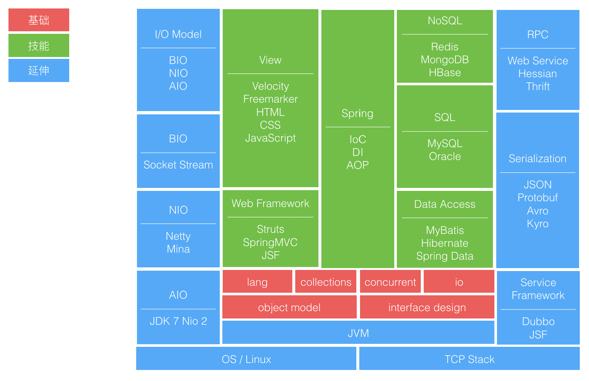

# 学习笔记

## TODO

_能攻心则反侧自消，从古知兵非好战。不审势即严宽皆误，后来治蜀要深思。_

> 能采取攻心办法服人的，会使那些疑虑不安、怀有二心的对立面自然消除，自古以来深知用兵之道的人并不喜欢用战争解决问题；不能审时度势的人，其处理政事无论宽或严都要出差错，后代治理蜀地的人应该深思

## TODO

_蝴蝶过山门，轻舟过重山。一别两款，各生欢喜。解冤释结，更莫相憎。_

> 秋光更比春光好，蜂蝶纷纷不到门

> 轻舟已过万重山

> 这一次离别之后两个人都得到解脱，两个人都各自心生欢喜。

> 好多人好些事，搁在心里久了，就成了经年累月，成了你精心打扮过之后的样子，只会让你心里越来越重，可是在某一刻，当这个人再重新出现的时候，你会发现好像他真实的样子在你心里已经相去经年了，那大概就是人生释然的时刻吧

## 资料收集

[面试相关资料](note/awesome-interview.md)

Java 知识地图

[我是怎么练英语的](https://dsdshcym.github.io/blog/2017/09/24/how-do-i-practice-my-english/)

> 英语和编程语言的共性可能就在于两者都是实用性非常强的工具，都是用来交流用的，学习这样的工具时，最有效的方法可能就是「尽量多地去使用」了。对编程语言来说，相比英语来说少了听、说两个方面，只要多读、多写就可以了，而对于英语来说，则要从「听说读写」四个方面同时出发，多听、多说、多读、多写。
